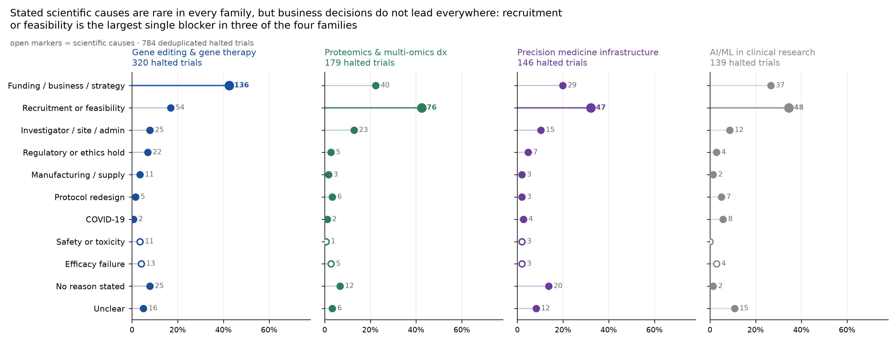
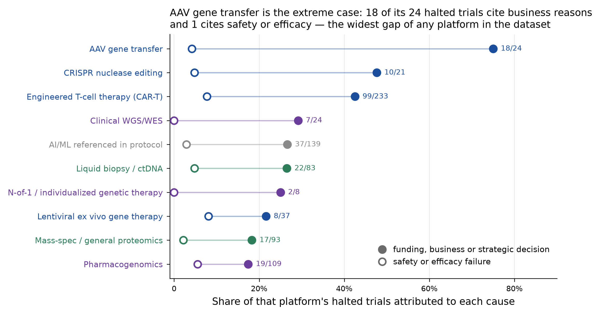
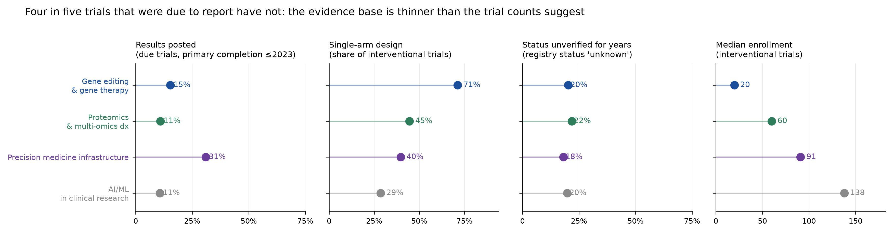
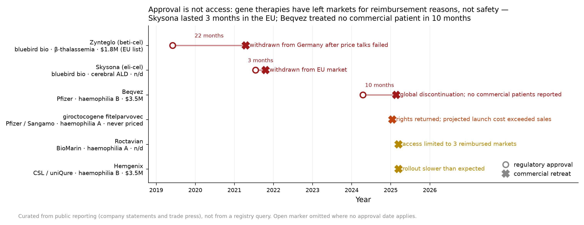
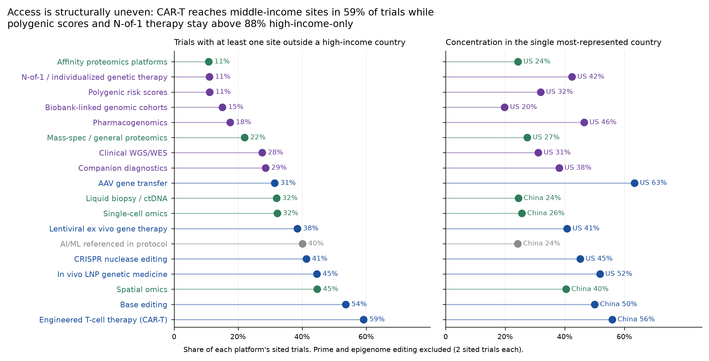

# What actually blocks implementation

**Companion to `technology_timeline_map.md`. Where that document maps how far each technology
has travelled, this one measures why programs stop — case by case — and sets out the economic
and ethical questions each technology raises at the point of implementation.**

Retrieval date: 2 September 2026.

---

## 1. The premise this document tests

The maturity map has a survivorship problem, and it is worth stating plainly because it
limits what the first document can be used to argue. A registry records trials that were
registered; a literature count records work that was published. Neither sees the program that
was never funded, the therapy that was approved and then quietly withdrawn, or the trial that
was registered and then abandoned without explanation. If technologies routinely die for
reasons that have nothing to do with whether they work, then a map of surviving activity
systematically overstates how much of the field is being decided on scientific merit.

That is a testable claim, not a rhetorical one. ClinicalTrials.gov requires sponsors to record
*why* a trial stopped. Across the 20 technology subfamilies, **851 trials** are terminated,
withdrawn or suspended, and **788 of them (93%) carry a stated reason** in free text. Those
reasons are the closest available measurement of what blocks implementation.

**Classification method.** The 673 distinct reason strings were classified into eleven
categories by a language model constrained to a fixed label set, instructed to prefer a
scientific cause whenever the text states one — so the non-scientific categories are lower
bounds. Two decisions matter for reading the results. First, **34 trials whose reason text
describes participants rolling into a long-term follow-up or extension study were classified
as administrative transfers and excluded from the failure analysis**; they are not failures,
and counting them as such would have inflated every blocker rate. Second, 112 trials whose
text carries no cause ("this clinical trial has been terminated") are kept as a visible
*not stated* category rather than being dropped or attributed. That leaves **817 halted
trials** in the analysis.

An earlier keyword-based pass left 31% of reasons unclassifiable and mislabelled the
rollover cases as failures; the per-category counts below come from the model pass, and the
full free text sits in `halted_trials_blockers.csv` so any classification can be audited or
redone.

---

## 2. The headline result

Across all four families, **251 halted trials cite a funding, business or strategic decision;
43 cite safety or efficacy failure.** That is a ratio of **5.8 to 1**. Programs in these
fields stop because someone decided to stop paying for them roughly six times as often as
because the science did not work.

Two secondary findings qualify it, and both matter:

- **Recruitment failure is the single largest blocker in three of the four families** —
  proteomics (77 of 182 halted trials), precision medicine infrastructure (51 of 156) and
  clinical AI (48 of 139). Only in gene editing and gene therapy does funding lead outright
  (141 of 340). Recruitment failure is not purely operational: for ultra-rare genetic
  indications it *is* the market-size problem appearing in a clinical costume, which is why
  the two categories should be read together rather than as rivals.
- **The scientific categories are small everywhere.** Safety accounts for 18 halted trials
  across all 14,061 records and efficacy failure for 25. This is partly real and partly an
  artefact: sponsors have a disclosure incentive to describe a stop as strategic rather than
  as a safety signal, and several funding-category texts explicitly volunteer that the
  decision was "not due to safety concerns". The direction of that bias inflates the funding
  category, so the 5.8:1 ratio should be read as an upper bound on the true ratio.

### The clearest single case

**AAV gene transfer is failing commercially while succeeding scientifically.** Of its 25
halted trials, **18 cite business or strategic reasons and 2 cite safety or efficacy** — the
most lopsided profile in the map, in the *most* clinically mature therapeutic modality here
(316 trials, 32 Phase 3+ programs, 67% industry-sponsored, first Phase 3 in 2003). This is not
a technology that failed to work. It is a technology whose economics stopped working.

CAR-T shows the same pattern at scale (104 business versus 20 scientific across 251 halted
trials), and CRISPR nuclease editing sits at 10 versus 1. The diagnostic and infrastructure
platforms are less lopsided — mass-spectrometry proteomics and pharmacogenomics both at
roughly 18% funding-attributed — largely because their trials are academic and smaller, so
they fail through recruitment rather than through a sponsor's portfolio review.

---

## 3. The graveyard the registry cannot see

The registry undercounts abandonment in two further ways, both measurable.

**Silent abandonment: 2,821 trials (20.1% of all records) carry registry status "unknown"** —
meaning the sponsor has not verified the record within the expected window. These are neither
completed nor formally terminated; they have gone quiet. The rate is remarkably uniform across
families (18–22%), which suggests a structural reporting failure rather than a
technology-specific one. Adding these to the 817 formally halted trials means roughly a
quarter of all registered activity in these fields has either stopped or gone dark.

**Unreported results: of 2,575 interventional trials whose primary completion date has passed
(2023 or earlier), only 18% have posted results.** Gene editing and gene therapy post at 15%,
clinical AI at 11%, proteomics at 11%; precision medicine infrastructure is the best at 31%
and still leaves seven in ten trials unreported. The evidence base is therefore materially
thinner than the trial counts in the maturity map imply, and the missing fraction is not
random — null and terminated trials are the least likely to be written up.

**Design fragility compounds it.** 71% of interventional gene-editing and gene-therapy trials
are single-arm, against 29% for clinical AI. Combined with a median enrollment of 20
participants, this means the therapeutic evidence in the most commercially advanced family
consists largely of small uncontrolled studies — appropriate for a first-in-human safety
question, but a weak foundation for the reimbursement decisions that Section 4 shows are
killing these products.

---

## 4. Approval is not access: the economic blocker made concrete

The registry cannot show what happens after approval, so this figure is curated from public
company statements and trade reporting rather than from a queried database — it should be
cited accordingly, and each row verified against the primary source before publication.

The pattern is the strongest available evidence for the concern that motivated this document.
Working, approved gene therapies have left markets for reimbursement reasons:

- Pfizer discontinued Beqvez, its haemophilia B gene therapy, less than a year after FDA
  approval, citing limited interest from patients and physicians, at a list price of
  $3.5 million; reporting at the time indicated no patients had received the therapy
  commercially in that window.
- bluebird bio withdrew Zynteglo from Germany after price negotiations failed, and
  subsequently withdrew Skysona as it wound down European operations — the latter within a few
  months of its EU approval.
- Pfizer also returned rights to a haemophilia A gene therapy developed with Sangamo despite a
  successful Phase 3 study, having concluded that the cost of launching it would exceed
  anticipated sales.
- bluebird bio — holder of three FDA-approved gene therapies — was ultimately sold to private
  equity for a fraction of its already-depressed market value.

Sources for each row, with dates, are listed in `commercial_retreat_cases.csv`; they are
company statements and trade press (pharmaphorum, BioPharma Dive, FiercePharma, STAT,
GEN, Global Genes), and each should be checked against the primary company announcement
before publication.

Read against Section 2, these are the same phenomenon at a later stage. The 18 AAV trials
halted for business reasons and the approved AAV products withdrawn for reimbursement reasons
are one continuous failure mode: **the technology clears the scientific bar and fails the
payment bar.** For a paper arguing about investment opportunity, this is the central
structural fact, and it cuts against naive optimism — the binding constraint on genetic
medicine is not whether editing works but whether a one-time cure can be paid for out of
annualised health budgets.

---

## 5. Case-by-case blockers

Each case states the binding constraint, the economic question, and the ethical question. The
distinction matters: the binding constraint is what the data shows stops programs; the
economic and ethical questions are the considerations a reader must weigh, and are argued from
the structure of the evidence rather than computed from it.

### 5.1 AAV gene transfer and lentiviral ex vivo gene therapy

**Binding constraint — reimbursement, not biology.** 72% of halted AAV trials cite business
reasons. Products that reached market have been withdrawn over price. Lentiviral ex vivo
therapy is the only subfamily in the map with *declining* publication volume (−6% annually
since 2020, peak year 2018) alongside 11 Phase 3+ programs — a field consolidating, not
growing.

**Economic question.** Can a durable one-time therapy be financed inside health systems built
for recurring costs? The candidate mechanisms — outcomes-based instalments, annuity payments,
reinsurance pools, subscription models — all exist on paper and none has yet produced a
commercially stable ultra-rare gene therapy launch. Small addressable populations mean a
withdrawal decision can follow a single failed national price negotiation, as it did in
Germany. Any market forecast for this modality that assumes approval implies revenue is
contradicted by the last five years.

**Ethical question.** Withdrawal after approval is an equity harm with no clean remedy: it
strands the patients who were counting on the therapy and, worse, the patients who enrolled in
the trials that produced it. There is a real question about what sponsors owe participants when
a program is shelved for portfolio reasons — access to continued treatment is rarely
guaranteed. A second question follows from the geography in the access figure: 31% of AAV
trials include a site outside a high-income country, but the reimbursement structures that
sustain a $3.5M therapy exist almost nowhere outside them, so populations may host the research
without any prospect of the product.

### 5.2 CRISPR nuclease, base, prime and epigenome editing

**Binding constraint — delivery, and sponsor concentration.** CRISPR has the map's highest
termination rate (21% of 118 trials, 10 of them for business reasons against 1 scientific).
The precision editors behind it are constrained differently: base editing has 28 trials, of
which 46% are industry-sponsored across just **four distinct industry sponsors** (roughly 13
trials), and prime and epigenome editing rest on two registered trials each. This is not a diversified pipeline; it is a handful of companies, and one strategic
retreat would visibly change the field.

**Economic question.** Editing is a platform, but it is being commercialised as a series of
single-indication products, each carrying the full cost of a bespoke delivery and manufacturing
package. Until a delivery vehicle can be reused across indications with an abbreviated
regulatory path, per-program economics stay closer to bespoke biologics than to a platform.
Note also that half of base-editing and 52% of CAR-T trials run sites in China, against
29–30% for the US: the cost base and regulatory route of the field's clinical activity are
increasingly not American, which matters for where value accrues.

**Ethical question.** Somatic editing raises consent and long-term-follow-up obligations that
outlast the sponsors — a 15-year follow-up commitment is a corporate promise, and Section 4
shows those promises are breakable. Germline modification remains outside legitimate practice
and is not what any trial in this dataset is doing, but the paper should distinguish it
explicitly, because public discussion routinely conflates the two and the conflation drives
policy. The concentration of activity in a few sponsors and two countries also raises a
governance question: oversight norms are set where the trials run.

### 5.3 AI-driven drug discovery

**Binding constraint — the clinical interval, not the discovery interval.** First-in-human 2020
to first Phase 3 starts in 2025–26 is five to six years, which is not faster than the industry
norm. 20% of the 30 trials in this cohort are already halted, and the single Phase 2/3 program
in the set was terminated. Whatever these platforms compress, it is upstream of the expensive
part.

**Economic question.** The investment case rests on a quantity no public source reports:
discovery-phase time and cost per candidate. Until that is disclosed comparably, the claim is
unfalsifiable, and valuations rest on it. The more testable near-term proposition is
Generate Biomedicines' generative-designed biologic entering Phase 3 — if that reads out, the
claim moves from "found faster" to "designed at all", which is a different and larger argument.

**Ethical question.** Two concerns are specific to this family. Attribution: "AI-designed" has
no regulatory definition and no verification path, so the label is a marketing claim that
investors and, increasingly, patients are being asked to price. And target selection: a
discovery engine optimises against the data it has, which is disproportionately
European-ancestry genomic and clinical data, so the diseases and variants it is best at
addressing are the ones already best served.

### 5.4 Proteomics and multi-omics diagnostics

**Binding constraint — recruitment and, beneath it, the absence of decision-change evidence.**
Recruitment failure ends 42% of this family's halted trials. More fundamentally, affinity
proteomics platforms have **41 records and one interventional trial in which the assay is named
as the intervention**; spatial omics has three. The literature is growing at up to 100%
annually while assay-guided interventional evidence is near zero. Industry sponsorship at 7.6%
is the lowest of any family.

**Economic question.** Payers reimburse tests that change management, not tests that measure
analytes. Liquid biopsy shows the path that works — 278 assay-guided interventional trials, 23
of them Phase 3+ — and it took roughly a decade. Affinity proteomics has generated
cohort-scale prognostic associations instead, which do not support a reimbursement claim. The
commercial risk here is not technical failure but indefinite pre-revenue validation.

**Ethical question.** A multi-analyte panel run on a research cohort generates findings of
uncertain significance at scale, with no established duty-to-return framework and no clinical
pathway for most of what it finds. Deploying prognostic panels ahead of decision-change
evidence risks a screening harm familiar from oncology: identifying more disease without
improving outcomes, while shifting cost and anxiety onto patients.

### 5.5 Precision medicine infrastructure

**Binding constraint — differs sharply within the family.** Pharmacogenomics is mature and
static (232 Phase 3+ trials, 17% of activity post-2020, publication growth 2%): its blocker is
adoption into workflow, not evidence. N-of-1 individualized therapy has 126 records at **4.8%
industry sponsorship** — real clinical activity with essentially no commercial model.
Biobank-linked cohorts have 112 records, 0.9% industry, and three assay-guided interventional
trials: discovery capacity with no mechanism returning decisions to patients. Polygenic risk
scores are the family's live question, now in randomized trials at a median enrollment of 831.

**Economic question.** This family is where clinical utility and investment return diverge
most. Pharmacogenomics captured its value into standard practice rather than into returns —
which is a public-health success and an investment cautionary tale simultaneously, and the
paper should say both. N-of-1 therapy is delivered as academic medicine because no
reimbursement mechanism prices a single-patient product; that is a policy gap, not a market
opportunity, unless regulation creates a platform-level pathway.

**Ethical question.** Polygenic scores carry the field's sharpest equity problem: predictive
performance degrades outside the ancestry composition of the discovery cohorts, so deploying
them at population scale risks distributing benefit along ancestry lines. This dataset can
show the exposure but not resolve it — 89% of PRS trials are high-income-country-only, the
second most concentrated in the map. Biobanks raise a distinct consent question: broad consent
obtained for discovery is being relied upon for uses, linkages and commercial partnerships not
contemplated when it was given.

---

## 6. Access and equity, measured

Two structural measures, both computed on an any-site basis over the 18 subfamilies with at
least 20 sited trials.

**Who is studied.** CAR-T includes a site outside a high-income country in 59% of trials and
base editing in 54% — driven by the volume of Chinese clinical activity, not by access
programs in low-income settings. At the other end, affinity proteomics (11%), N-of-1 therapy
(11%) and polygenic risk scores (11%) are almost entirely high-income-country research. The
technologies most likely to be deployed as population-level screening tools are those developed
in the least representative populations, which is precisely the configuration that produces
performance gaps on deployment.

**Where activity concentrates.** AAV gene transfer runs 63% of its trials with a US site;
CAR-T is 56% China. No platform in the map is genuinely globally distributed. For the paper's
purposes this means "clinical utility if successfully implemented" is a question with different
answers in different health systems, and a single global market forecast will be wrong for most
of them.

A caveat on interpretation: a site in a middle-income country indicates where research happens,
not that the resulting product will be affordable there. Given Section 4, the opposite is more
likely.

---

## 7. What would strengthen this analysis

1. **Deal and financing data**, which remains the missing half. The blocker analysis now shows
   *that* funding decisions dominate; it cannot show whose money left, when, or at what
   valuation. A deal table keyed by company would join onto `halted_trials_blockers.csv`
   through the sponsor field and turn "a business decision" into a dated, priced event.
2. **Systematic post-approval outcome tracking.** Figure 8 is six hand-curated cases. A
   complete accounting of approved cell and gene therapies with launch dates, list prices,
   patients treated and market-withdrawal events would convert the strongest argument in this
   document from illustrative to quantitative. Sources: FDA and EMA product registers, company
   filings, national HTA decisions.
3. **Non-US registries** (CTIS, the Chinese registry, jRCT), which would correct both the
   geography and the termination-rate estimates.
4. **Sponsor-level survival analysis.** The data to ask "which companies registered once and
   stopped, and which compounded programs" is already in `trial_records.csv`; first-to-last
   trial intervals per sponsor would be a better commitment signal than trial volume, and would
   identify the funding-driven exits directly.

---

## 8. Files

| File | Contents |
|---|---|
| `halted_trials_blockers.csv` | 851 halted trials with verbatim stated reason and assigned blocker category — the audit trail for Section 2 |
| `blocker_matrix_by_subfamily.csv` | Blocker counts, 17 subfamilies × 11 categories (the four subfamilies with no halted trials — AI-originated candidates, spatial omics, prime and epigenome editing — are absent) |
| `evidence_quality_by_family.csv` | Results-posting, single-arm, unverified-status and median-enrollment rates by family |
| `access_equity_by_subfamily.csv` | Country counts, non-high-income site share, top-country concentration, multinational share |
| `commercial_retreat_cases.csv` | The six curated post-approval commercial events in Figure 8, with dates and sources to verify |
