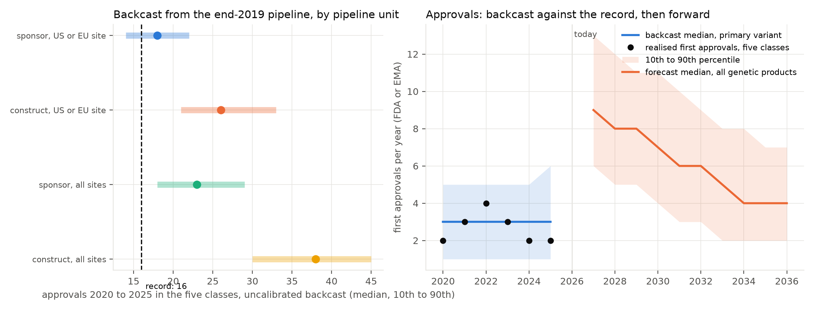
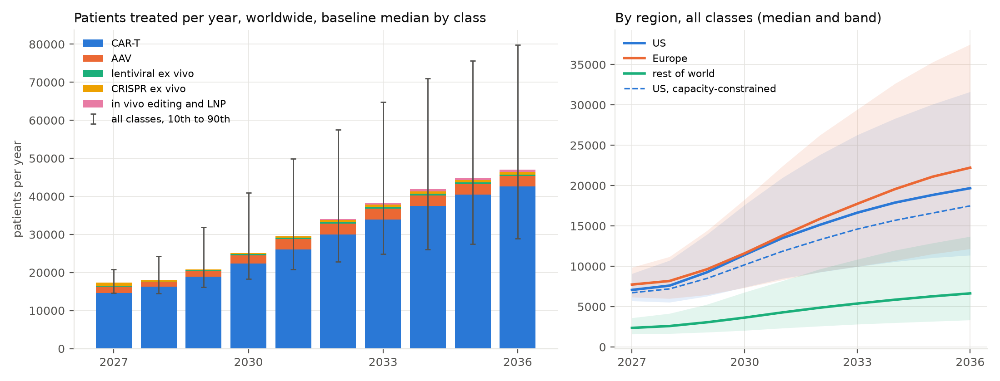
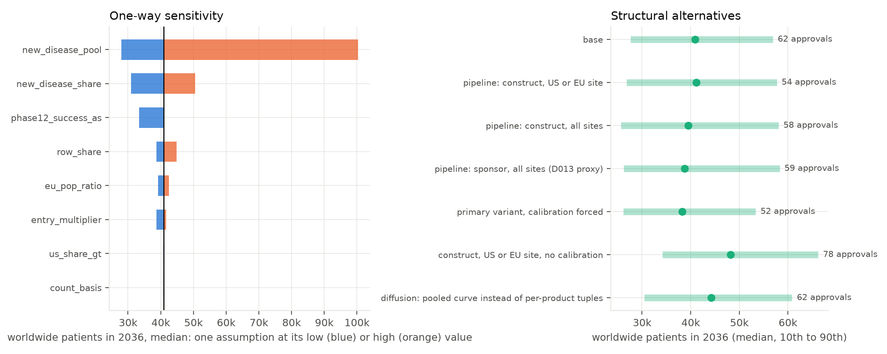

# The landscape to 2036

*What the measured record implies for gene and cell therapy approvals, funded access, patients treated and hospital
capacity over the next ten years. Model and tables: `data/projection/`, decision D014, findings F048 to F050.*

## The question

Forecasts made in 2020 and 2021 got the number of approvals right and the number of patients wrong. They projected
demand from the pipeline and skipped the two stages that sit between approval and treatment: the funding decision in
each health system, and the slow diffusion of a one-time therapy through hospitals, referral networks and eligible
patients. This projection chains all three stages, each measured on the 43 products approved so far, and is run
backwards over 2020 to 2025 before it is run forwards.

## How the model works

1. **Approvals.** The trial registry is reduced to industry constructs (one named intervention of one sponsor), and the
   pipeline unit is the sponsor's lead programme in each class among constructs with at least one trial site in the
   United States or Europe (CAR-T 26, 32 and 9 programmes at phases 1, 2 and 3; AAV 8, 29 and 12; lentiviral 3, 5 and
   3; CRISPR 3, 5 and 1; in vivo editing 2, 6 and 0). Each survives its remaining phases at the published rates for its
   class and, if it succeeds, reaches approval after a clinical stage drawn from the measured distribution for the class,
   conditional on the time it has already spent in trials; phase-3 programmes draw from the cohort's own phase-3-to-
   approval times. New programmes enter at the 2021 to 2025 rate.
2. **Backcast.** Four ways of counting the pipeline were run from the end-2019 registry against the 16 approvals of
   2020 to 2025 (Figure P1, left). Counting every construct at every site predicts 38; counting one programme per
   sponsor at every site, the unit used on 6 September, predicts 22; only one programme per sponsor with a Western
   trial site predicts 18 (range 13 to 23) and covers the record year by year. That unit is used forward with no
   calibration factor. The choice was made on the validation data and the other three units are reported as
   alternatives (Figure P3, right).
3. **Funded access.** Each approval draws the time to its first funding decision in each of seven systems from the
   cumulative incidence measured on every authorised product, with refusals and market withdrawals as competing events
   (Figure P4): five years after authorisation, Germany has funded 0.83 of products, Australia 0.88, Italy 0.70,
   England 0.53, France 0.48, Canada 0.42; in the United States every product with public sales has revenue within a
   year.
4. **Patients.** Uptake follows Bass diffusion curves. CAR-T as a class follows the curve fitted to the registry
   totals in each region (the United States 5,266 and Europe 6,082 patients in 2024); a quarter of new CAR-T approvals
   are assumed to open a new disease with its own eligible pool. One-time gene therapies continue their own fitted
   curves, and each new approval draws its parameters from the ten products observed so far, whose ceilings run from
   2 to 100 percent of the eligible pool. A class curve predicts a held-out product only within a factor of two to
   three, so the spread between products is carried into the projection rather than averaged away.
5. **Capacity.** CAR-T demand is set against qualified centres (171 accredited in the United States, 278 reporting in
   Europe) growing at the observed European rate of 12 percent a year, or at the 1 percent a year of US accreditation,
   and the observed patients per centre (22 across Europe, 37 in Germany).
6. **Uncertainty.** Fourteen assumptions carry a range and a source and are drawn within their ranges in the headline
   run; each is also varied alone (Figure P3, left). Every parameter is in `data/projection/projection_parameters.csv`,
   and the validity tests are listed in `validation.csv`.

## What it says

**Approvals come in a bulge, then a trough.** The median path is 63 first approvals of genetic products between 2027
and 2036 (range 54 to 73): 20 CAR-T, 22 AAV, 4 lentiviral, 3 CRISPR, 3 in vivo, and about 10 from other vectors at the
historical rate. Nine a year arrive in 2027 and eight in 2028 and 2029 as today's phase-2 and phase-3 stock clears,
falling to four a year from 2034 unless entry rises; entry at half or one and a half times the recent rate moves the
ten-year total between 58 and 67. Programmes entering phase 1 now reach approval, if they do, after 2033.

**Patients treated nearly triple by 2036, and the range is wide.** Worldwide, about 17,500 patients a year in 2027
become 31,800 in 2031 (range 20,800 to 50,000) and 48,900 in 2036 (28,900 to 79,800). In the United States the model
reaches 13,500 a year by 2031 and 19,700 by 2036; Europe 13,800 and 22,200; the rest of the world 4,300 and 6,600.
CAR-T stays seven eighths of the total. One-time gene therapies together reach about 2,500 a year in the United States
and 1,500 in Europe by 2036, most of it AAV.

**Funded access widens unevenly.** Products with a positive funding decision rise from 25 to about 77 in the United
States by 2036, 20 to 62 in Germany, 7 to 52 in Australia, 16 to 49 in Italy, 13 to 39 in England, 12 to 36 in France
and 7 to 33 in Canada. The gap between systems is set less by how long a decision takes than by how many authorised
products ever get one, and by how many are never submitted.

**Faster decisions add a little; capacity binds in the United States.** Funding every approval at the fastest observed
speed adds 7 percent to patients treated in 2036. Holding centre growth to the European trend and throughput to the
German level removes 10 percent, and the constraint falls on the United States: 16,000 CAR-T patients a year in 2036
need 430 to 730 treatment centres against 193 if accreditation keeps its recent pace (capacity about 7,100 a year) or
540 if US centres grow as Europe's have. Europe's network covers its projected demand at trend.

## Assumptions that move the answer

- The eligible flow of a newly opened CAR-T disease: across the observed range of indication flows (400 to 9,700 US
  patients a year) the 2036 total moves from 27,900 to 100,400. This is the assumption to replace first, with the
  diseases now in phase 3.
- The share of CAR-T approvals that open a new disease (0.10 to 0.40 gives 30,900 to 50,500).
- Whether a phase 1/2 programme has cleared phase 1 (treating it as phase 1 gives 50 approvals and 33,300 patients).
- The CAR-T class ceiling, identified only within a factor of two from seven years of registry totals (United States
  9,000 a year, 4,100 to 21,700).
- The pipeline unit: the construct-level count needs a calibration factor of about 0.5 to reproduce the record, and
  gives 54 approvals with it or 78 without.
- The funding band per system, which moves England's funded products between 33 and 45 by 2036 without changing
  patient volume much.

## What would change the picture

A rise in phase-1 entry from 2025 onward lifts the trough after 2033. In vivo delivery that removes the centre and
apheresis constraint would change the CAR-T curve, not the approval count, within this window. A system that funds a
larger share of authorised products (Germany's 0.83 against France's 0.48) matters more for its patients than one that
decides faster.

## Limitations

The registry does not say which programmes intend to file with FDA or EMA; the site filter is a proxy, and the unit
was chosen because it reproduced the record. Funding curves rest on 8 to 28 products per system, and England's use
the EU date for products authorised after 2020. Patient counts for one-time therapies come from revenue at a class
net-to-list factor; eligible pools carry the gaps listed in F039. Rest-of-world patients are a share anchored on
Japanese, Chinese and Gulf registry rows, not modelled. The predictive test, the 2027 record against this projection,
is open.
