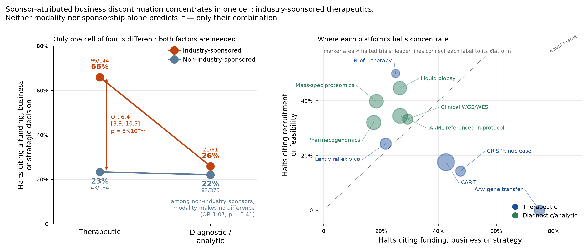
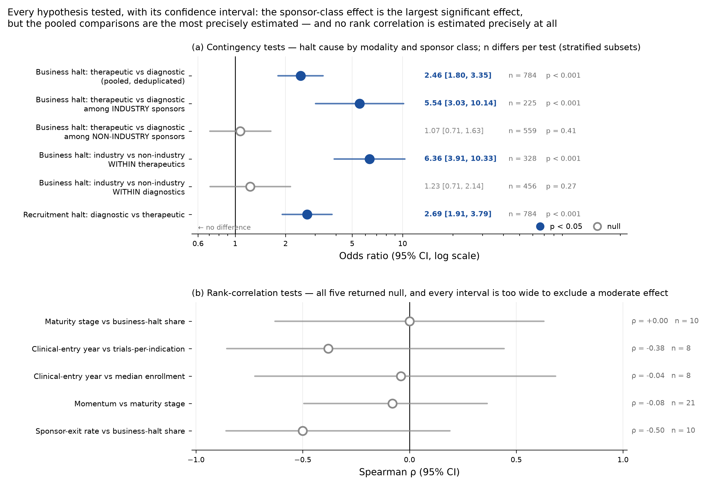
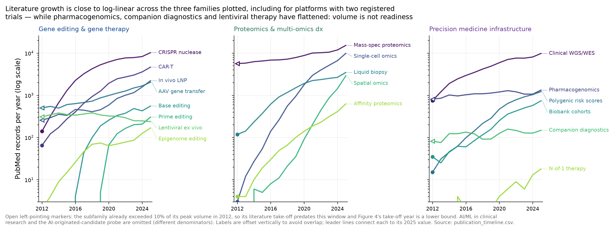
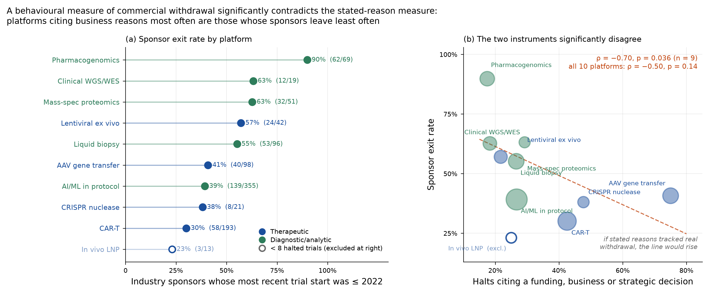
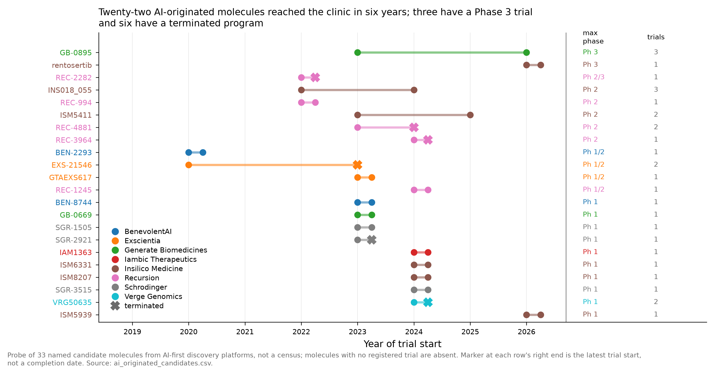

# Business-attributed discontinuation in molecular precision medicine concentrates in industry-sponsored therapeutic programs

### A registry analysis of 14,061 clinical trials and 784 halted trial registrations across 21 gene, editing, proteomic and precision-medicine technologies

**Draft v8 — 7 September 2026.** All counts computed from ClinicalTrials.gov (API v2) and PubMed records retrieved on
5 September 2026, plus the matched non-molecular comparator retrieved on 7 September 2026 (Section 3.5, F052). Every
number is traceable to a named column in the supplementary tables. v8 adds the comparator result to the abstract,
Section 3, Limitation 3c and Section 8; the revision note is in `review/revision_notes.md`.

---

## Abstract

Molecular precision medicine is usually described as a field waiting on biology. Across registered
clinical activity, it is not what stops programs. Using 14,061 registry-filtered trial records
across 21 technology subfamilies, and 673 distinct verbatim sponsor statements explaining why
trials stopped, we find that funding, business and strategic decisions are cited in 242 of 784
halted trials against 40 citing safety or efficacy failure. That contrast is not uniform, and its
structure is the paper's main result: **sponsor-attributed business discontinuation concentrates
almost entirely in one cell — industry-sponsored therapeutic programs, at 66% (95/144), against
22–26% in the other three cells of the modality-by-sponsor table.** Neither factor alone accounts for it: the modality contrast is three to six
times larger among industry sponsors than among non-industry ones (OR 5.54, p = 6 × 10⁻⁹ versus
OR 1.07, p = 0.41 at trial level; 6.10 versus 1.72 with one row per sponsor), and sponsor class
is the stronger exposure within therapeutic programs (OR 6.36, p = 5 × 10⁻¹⁵) while doing nothing
within diagnostics (1.23, p = 0.27). The interaction survives excluding the dominant subfamily
and survives collapsing to one row per sponsor. It does not survive the comparison that matters most: 378
industry-sponsored halted drug trials outside molecular medicine, matched on phase and start year and classified
under the same instruction, cite business reasons at 60% against the cell's 64% (p = 0.34). The effect is therefore a
property of programs carried by a commercial sponsor making a portfolio decision, not of therapeutic biology and not
of molecular precision medicine in particular. It is most visible in
the earliest therapeutic modality to reach pivotal trials: AAV gene transfer, with 32 Phase 3 or
later trials since 2003, has 18 of 24 halted trials citing business reasons and 1 citing science.
Post-approval, gene therapies have been withdrawn from markets over reimbursement rather than
safety — the only evidence in this study in which price and payers are directly documented.
We report four negative results — including an independent behavioural instrument (sponsor exit
from a platform) that does not merely fail to corroborate the stated-reason finding but
**significantly contradicts it** (ρ = −0.70, p = 0.036) — and we set out three structural limits:
no stated reason names a payer or a price, the reason field observes only 24.7% of concluded
Phase 2+ trials, and the headline ratio ranges from 0.8 to 6.1 across defensible category
boundaries, a range that includes parity. Only the stratified contrast carries weight; the
magnitude of the aggregate ratio does not. We conclude that the constraint these data identify is the commercial
sponsor's portfolio decision, that its interpretation as a payment mismatch is supported by the
post-approval record rather than by the registry, and that the two claims should be argued
separately.

---

## 1. Introduction

Attention in health-care artificial intelligence and in translational medicine more broadly is
concentrated on the operational and perceptual layers of clinical practice. Of 5,601 registered
trials in this dataset that reference artificial intelligence or machine learning, 46% address
imaging or pathology and 9 — 0.2% — address molecular or drug discovery (Supplementary Figure
S1). Molecular precision medicine, meanwhile, is discussed largely as a scientific frontier:
the questions asked of it are whether editing is specific enough, whether delivery reaches the
right tissue, whether a proteomic signature replicates.

Those are real questions, and for the newest editors they are still the binding ones. But they
are not what is currently stopping programs. This paper measures what is.

The measurement is possible because ClinicalTrials.gov requires sponsors to record a reason
when a trial is terminated, withdrawn or suspended. That field is an underused instrument: it
converts a question usually addressed through interviews and case studies into one that can be
counted. Across 21 technology subfamilies spanning gene editing and gene therapy, AI-driven
drug discovery, proteomic and multi-omic diagnostics, and precision-medicine infrastructure, we
classify 673 distinct sponsor statements and ask a simple question — when these programs stop,
what stops them?

The answer reframes what the field's central problem is, and therefore what work is worth
doing. Our thesis is that in molecular precision medicine the binding constraint is no longer
whether the biology works; it is that these technologies create value in a shape — durable,
one-time, small-population, decision-changing — that neither health-system budgets nor capital
markets are built to price. We develop that claim, bound it, and state what our evidence
cannot support.

**A note on what this study is and is not.** This is an analysis of registered clinical
activity and its stated failure causes. It is not a financial study: no deal, valuation or
funding-round data was available, so where we discuss capital markets we do so from
sponsor-stated reasons and from public reporting, both of which we label as such. The absence
of a financing layer is the single largest gap in this work and is discussed in Section 8.

---

## 2. Results

### 2.1 Business-attributed discontinuation concentrates in industry-sponsored therapeutics

*(bundle path: `figures/Figure_1_constraint_map.png`)*

**Figure 1. Where sponsor-attributed business discontinuation occurs.** *(a)* Share of halted
trials citing a funding, business or strategic decision, by modality and sponsor class; labels
give the count over the cell total. *(b)* Per-platform position between the two dominant causes.
Marker area is proportional to halted trials. Platforms with fewer than 8 halted trials are
omitted. n = 784 deduplicated halted trials.

Of 851 halted records (terminated, withdrawn or suspended), 788 (93%) carry a stated reason. We
exclude 34 whose text describes participants transferring into a long-term follow-up or extension
study — administrative transfers, not failures — and deduplicate 33 registrations that matched two
subfamily queries, leaving **784 unique halted trials**. Across these, 242 cite a funding, business
or strategic decision and 40 cite a safety or efficacy failure.

That 6-to-1 contrast is real but is not evenly distributed, and the distribution is the finding.
Cross-tabulating by modality and sponsor class produces one outlying cell:

| | Industry-sponsored | Non-industry |
|---|---|---|
| **Therapeutic** | **66.0%** (95/144) | 23.4% (43/184) |
| **Diagnostic / analytic** | 25.9% (21/81) | 22.1% (83/375) |

Three of the four cells sit within four percentage points of each other. The fourth is nearly
three times higher. Formally: among non-industry sponsors the modality contrast is small and, at trial level,
not significant (OR 1.07, p = 0.41, n = 559); among industry sponsors it is large (OR 5.54,
p = 6 × 10⁻⁹, n = 225). Collapsing to one row per sponsor — the cluster-robust unit our own
mechanism implies — gives OR 6.10 (p = 1.1 × 10⁻⁷) among industry sponsors and OR 1.72
(p = 0.029) among non-industry ones: on that basis the non-industry contrast is not absent but
is three and a half times smaller. Excluding the dominant subfamily (CAR-T) the industry
contrast is OR 4.60 (p = 7 × 10⁻⁵) and the non-industry contrast disappears (OR 0.93, p = 0.64).
Sponsor clustering is a milder threat than it might appear: the focal 144-trial cell spans 88
distinct sponsors, the largest contributing 6.2% and the top five 17.4%; and within therapeutic programs, sponsor class is the stronger exposure
(66.0% versus 23.4%, OR 6.36, p = 5 × 10⁻¹⁵).

The pooled therapeutic-versus-diagnostic comparison — 42.1% versus 22.8%, OR 2.46,
p = 7 × 10⁻⁹ — is therefore a composition artefact of that interaction and should not be read as
a modality mechanism. **What the data identify is not a property of therapeutic biology but a
property of programs carried by a commercial sponsor that can make a portfolio decision about
them.** Diagnostic programs remain distinguished by their dominant *alternative* cause: 36.5% of
halted diagnostic trials cite recruitment or feasibility against 17.7% of therapeutic ones
(OR 2.69, p = 2 × 10⁻⁹), and that contrast does not depend on sponsor class.

Figure 1b shows the per-platform consequence. AAV gene transfer sits at the extreme (75%
business, 0% recruitment); the academic-dominated diagnostic platforms cluster in the
recruitment corner. N-of-1 individualized therapy is the instructive case: a therapeutic modality
at 4.8% industry sponsorship, it sits with the diagnostics, which is what the interaction
predicts.

**Three limits on how far this finding can be read.** They are stated here rather than deferred
because each bounds the interpretation directly.

*The category cannot identify a payment mechanism.* We searched all 784 verbatim reason strings
for any mention of a payer, price, reimbursement decision, coverage, formulary or health
technology assessment. **Not one contains such a term.** The label records that a sponsor decided
to stop, not why the economics failed. We therefore use the term *sponsor-attributed business
discontinuation* throughout, and reserve claims about pricing and payment for Section 2.6, where
they are documented. Restricting the category to the strings that explicitly name a financial cause — a published
boolean column, `names_financial_cause`, with its term list given in Methods — reduces it from
242 to **79**.

*The instrument is blind to how scientific failure usually presents.* An efficacy failure in a
later-phase trial typically appears as a trial that completes and misses its endpoint, not as a
halt with a stated reason. Among concluded Phase 2+ interventional trials in this dataset — deduplicated, and excluding
combined Phase 1/2 designs — 414 completed and 136 halted: the reason field observes only
**24.7%** of concluded programs (30.3% if Phase 1/2 designs are included), and it
is precisely the subset where science is least likely to be named. The ratio in this section
describes halted trials, not programs.

*The ratio depends on category boundaries, and not only in magnitude.* As categorised it is 6.1
to 1 (242:40). Counting manufacturing and regulatory holds as technical rather than commercial
causes gives 2.5 to 1 (242:97); restricting the business category to the strings that explicitly
name a financial cause gives 2.0 to 1 (79:40); **both adjustments together give 0.8 to 1**
(79:97) — that is, stated scientific and technical causes would slightly outnumber
explicitly-financial ones. The direction is therefore *not* robust across the defensible range,
and we do not claim it is. What survives every boundary choice is the stratified contrast in the
previous subsection, which is a within-halted comparison and does not depend on the category
totals at all. Readers should treat the aggregate ratio as uninformative about magnitude and
read the interaction instead. Note also that the manufacturing assignment is in tension
with Section 4.5, which argues manufacturing is a technical bottleneck.

Finally, sponsors have a disclosure incentive to describe a stop as strategic rather than as a
safety signal — **12 of the 242** business-category texts volunteer, unprompted, that the decision
was not due to safety or efficacy concerns — so the business category is an upper bound and the scientific categories lower bounds.

### 2.2 The pattern holds in every technology family

*(bundle path: `figures/Figure_2_blocker_profiles.png`)*

**Figure 2. Blocker profile by technology family.** Share of each family's halted trials
attributed to each of eleven categories, on the 784-trial deduplicated set. Open markers denote
scientific causes; the emphasised row in each panel is that family's largest blocker.

Funding and business decisions outnumber safety and efficacy failures in all four
registry-derived families. Figure 2 is computed on the same 784-trial deduplicated set as
Section 2.1 (gene editing 320 halted trials, proteomics 179, precision medicine 146, clinical
AI 139).

Recruitment failure is nonetheless the single largest blocker in three of the four families,
leading in proteomics (76/179), precision medicine (47/146) and clinical AI (48/139); only in
gene editing and gene therapy does funding lead outright (136/320 against 54/320). Across the
whole dataset the two are close — business 242 of 784 halts (30.9%) against recruitment 225
(28.7%), a 2.2-point difference that is not significant (one-sided binomial p = 0.23) — so we do
not claim business causes dominate halting in general, only that they dominate the comparison
against *stated scientific* causes and that they concentrate where Section 2.1 shows. We do not treat recruitment and
funding as rival explanations, but we also do not assert a mechanism linking them: the intuition
that recruitment failure is the small-market problem in clinical dress is contradicted by this
dataset's flagship case, since AAV gene transfer is the ultra-rare modality par excellence and has
zero recruitment-cited halts among 24 — against a 17.7% base rate across therapeutic platforms,
an exact binomial p = 0.009. That is a result rather than a rhetorical point, and it is
counterintuitive for the modality with the smallest addressable populations in the dataset. The two categories are separated here because sponsors describe them
separately.

The scientific categories are small throughout: across all 784 deduplicated halted trials, 40
cite safety or efficacy failure in total. All figures and counts in this paper are computed on
that same deduplicated set.

### 2.3 The earliest genetic modality to reach pivotal trials is the most commercially fragile

*(bundle path: `figures/Figure_3_funding_vs_science.png`)*

**Figure 3. Funding versus scientific causes of trial halt, by platform.** Platforms with at
least 8 halted trials, on the 784-trial deduplicated set. Filled markers: funding, business or strategic decisions. Open markers:
safety or efficacy failures. Labels give business-cited halts over total halts.

AAV gene transfer is the clearest case in the dataset. It is the earliest therapeutic modality
in scope to reach the clinic and pivotal trials — 316 trials, first registered trial in 1999,
first Phase 3 in 2003, 32 Phase 3 or later trials, 67.4% industry-sponsored — and **18 of its 24
halted trials cite business or strategic reasons against 1 citing safety or efficacy**, the
widest gap of any platform in the dataset. (Four
therapeutic platforms tie at the top stage of the maturity ladder, so "most mature" is not a
property we can assign uniquely; "earliest genetic modality to reach pivotal trials" is, and it is
the property the argument uses and the heading states. Among genetic therapeutic subfamilies the
first Phase 3 years are AAV 2003, lentiviral ex vivo 2010, in vivo LNP 2013, CAR-T 2015 and CRISPR
nuclease 2018; the N-of-1 subfamily's Phase 4 entry in 2000, NCT00000428, is an N-of-1-design trial
of fibromyalgia treatments caught by the query, not a genetic therapy, and is excluded from this
comparison.) Among trials that halted, this is not a technology stopped by its biology — though
Section 2.1's censoring limit means we cannot speak to programs that completed and missed.

CAR-T reproduces the pattern at scale (104 business versus 20 scientific across 251 halts) and
CRISPR nuclease editing sits at 10 versus 1. The diagnostic and infrastructure platforms are
less lopsided — mass-spectrometry proteomics and pharmacogenomics both at 17.9% — because their
trials are predominantly academic and smaller, and fail earlier, through recruitment.

### 2.4 How maturity was measured, and what it shows

*(bundle path: `figures/Figure_4_technology_timelines.png`)*

**Figure 4. Technology timelines.** For each subfamily: the year publication volume first
reached 10% of its maximum (literature take-off), the first registered interventional trial,
and the first Phase 3. Crosses mark platforms with no Phase 3 to date. Bands group subfamilies
by family. The PubMed window is 2012–2025; six subfamilies (AAV, in vivo LNP, lentiviral,
CAR-T, mass-spec proteomics, pharmacogenomics) already exceeded the 10% threshold in 2012, so
their take-off year is a **lower bound** — the flag is published as
`literature_predates_2012_window`.

The maturity axis used throughout is built from three registry milestones per technology.
Reading it produces one structural observation that frames the rest of the paper: **delivery
matured roughly a decade before precision.** AAV gene transfer registered its first trial in
1999 and its first Phase 3 in 2003; lentiviral ex vivo therapy followed in 2006. CRISPR
nuclease editing entered the clinic in 2016 and reached Phase 3 in 2018 — a two-year transit,
the fastest among the gene-transfer modalities and tied with in vivo LNP, plausibly because it
inherited a de-risked delivery and manufacturing stack rather than building one.

The editors that solve specificity have not inherited that advantage. Base editing has 28
registered trials and no Phase 3; prime editing has 2 trials, first registered in 2024;
epigenome editing has 2, first registered in 2025. For these three, the constraint is still
biology — delivery and specificity — and no payer has yet been asked to buy anything. This
bounds our thesis, and Section 4 states the bound explicitly.

### 2.5 Research momentum does not track clinical maturity

*(bundle path: `figures/Figure_5_momentum_vs_maturity.png`)*

**Figure 5. Momentum against maturity.** Share of each platform's registered trials that
started in 2021 or later, ranked, with a five-step trial-stage maturity meter and total trial
count. Stage values are generated mechanically from the rules in Section 7 with no manual
overrides.

Newness of activity carries no information about clinical maturity: across the 21 subfamilies,
the rank correlation between share-of-trials-since-2021 and maturity stage is **ρ = −0.08
(p = 0.74)**. Four of the seven highest-momentum platforms have not reached pivotal evidence;
three of the seven lowest-momentum platforms are at Phase 3+ *scale* (stage 5 of the maturity
ladder), and five have reached at least one Phase 3. Spatial omics has the
steepest literature growth in the dataset (publication volume doubling annually since 2020) and
three interventional trials naming the assay as the intervention. Pharmacogenomics has 232
Phase 3 or later trials and the lowest momentum in the map (16.8% of its activity since 2021).

For a reader allocating attention or capital, this is the practical consequence: activity
volume and readiness are separate quantities, and the field's most visible platforms are not
its most deployable ones.

### 2.6 The failure mode survives regulatory approval

*(bundle path: `figures/Figure_6_commercial_retreat.png`)*

**Figure 6. Commercial retreats of gene therapies, with the approval-to-retreat interval where
an approval date applies.** Three of six rows have a dated approval and therefore an interval;
one (giroctocogene fitelparvovec) was never approved and is a returned-rights event. Curated from
company statements and trade reporting, not from a registry query; each row's source and retrieval
date are in the supplementary case table.

This evidence is curated and small (n = 6), and we flag that. But it is not weaker evidence for
the payment mechanism — it is the **only** direct evidence of it in this study. Section 2.1
measures the scale of sponsor-attributed discontinuation without observing a single price or
payer; this section observes prices and payer decisions without a denominator. The two are
complementary, and the honest ordering is: the registry establishes that commercial sponsors
withdraw at scale, and these cases establish that reimbursement is one reason they do. Neither
alone supports the claim that reimbursement explains the registry pattern.

Pfizer discontinued Beqvez, its haemophilia B gene therapy, less than a year after FDA
approval, citing limited interest from patients and physicians, at a list price of
$3.5 million; contemporaneous reporting indicated no patients received the therapy
commercially in that window. bluebird bio withdrew Zynteglo from Germany after price
negotiations failed, and subsequently withdrew Skysona as it wound down European operations —
the latter within a few months of its EU approval. Pfizer returned rights to a haemophilia A
gene therapy developed with Sangamo despite a successful Phase 3, having concluded that launch
costs would exceed anticipated sales. bluebird bio, holder of three FDA-approved gene therapies, was
ultimately sold to private equity for a fraction of its already-depressed market value (reported
by *GEN* in 2025; a company-level event rather than a product withdrawal, and for that reason
deliberately **not** included in the six-row case table with its
source but is not plotted in Figure 6).

These are not safety withdrawals. They are the same failure mode as the 18 halted AAV trials,
observed one stage later: the technology clears the scientific bar and fails the payment bar.

### 2.7 The visible evidence base is thinner than the trial counts imply

*(bundle path: `figures/Figure_7_evidence_quality.png`)*

**Figure 7. Evidence quality and reporting by family.** Results-posting rate among
interventional trials whose primary completion date has passed; single-arm share of
interventional trials; share of all records with unverified registry status; median enrollment.

Two forms of attrition are invisible in a trial count. **2,821 records (20.1%) carry registry
status "unknown"** — the sponsor has not verified the record within the expected window. These
are neither completed nor formally terminated; they have gone quiet. The rate is near-uniform
across families (18.0–21.8%), which points to a structural reporting failure rather than a
technology-specific one. Adding these to the 817 formally halted trials, roughly a quarter of
all registered activity in these fields has stopped or gone dark.

**Of 2,517 unique interventional trials whose parsed primary completion date is on or before 31
December 2023, only 18.2% have posted results.** Precision-medicine infrastructure is the best at
31.5% and still leaves seven in ten unreported; gene editing and gene therapy posts at 15.3%,
proteomics at 11.1%, clinical AI at 10.6%. The per-trial flag used for this denominator is
published as the `due` column of `trial_records.csv` so the figure can be reproduced exactly. The missing fraction is not concentrated in failures: among due trials, those that halted posted
results at 23.5% (78/332) against 17.4% for those that did not, so the shortfall is general
rather than a selective suppression of negative outcomes.

Design adds a third qualification. 71.2% of interventional gene-editing and gene-therapy trials
are single-arm, against 28.6% for clinical AI, and median enrollment in that family is 20
participants. The therapeutic evidence in the most commercially advanced family therefore
consists largely of small uncontrolled studies — appropriate for a first-in-human safety
question, but a weak foundation for the reimbursement decisions that Section 2.6 shows are
determining these products' fate.

### 2.8 Access is structurally uneven, in a specific direction

*(bundle path: `figures/Figure_8_access_equity.png`)*

**Figure 8. Access and concentration.** Left: share of each platform's sited trials with at
least one site outside a high-income country. Right: share with a site in the single
most-represented country. Platforms with fewer than 20 sited trials are excluded.

CAR-T includes a site outside a high-income country in 59.2% of trials and base editing in
53.6%, driven by the volume of Chinese clinical activity rather than by access programmes in
low-income settings. At the other extreme, affinity proteomics (10.8%), N-of-1 therapy (11.0%)
and polygenic risk scores (11.1%) are almost entirely high-income-country research.

The direction matters. The technologies most likely to be deployed as population-level
predictive or screening tools are those developed in the least representative populations —
precisely the configuration that produces performance gaps on deployment. Meanwhile no platform
is genuinely globally distributed: AAV gene transfer runs 63.4% of its trials with a US site,
CAR-T 55.9% with a Chinese site.

A caveat against over-reading the left panel: a site in a middle-income country indicates where
research happens, not that the product will be affordable there. Given Section 2.6, the
opposite is the more likely outcome.

---

## 3. What the evidence does not support

Four extensions and corroborations of our thesis were tested because each would have
strengthened it. All four failed. We report them because they pre-empt the objections a careful
reader would raise, because two rule out attractive but wrong policy conclusions, and because one
— the sponsor-exit test in 3.3 — is a direct challenge to the paper's own instrument. Section 3.5
is not a test but a scope limit. Full statistics are in the supplementary test record.

**3.1 Maturity does not predict commercial failure.** The natural story — that platforms die of
money once they advance far enough to need money — is absent. Across the ten platforms with
enough halted trials to measure, the rank correlation between maturity stage and
business-attributed halt share is **ρ = 0.00 (p = 1.00)**. This test is weak in a way worth
stating: those ten platforms take only two distinct stage values (four at stage 4, six at stage
5), so the design cannot address stage-dependence across the pipeline at all. The defensible
descriptive statement is that business-attributed halting occurs at both stages we can measure,
and that we detected no stage-dependence with little power to detect one. We do not conclude that
the payment architecture is uniformly defective; that would be reading a null as a result.

**3.2 Precision is not measurably narrowing the addressable population.** The appealing
extension — that each increment of precision shrinks the market, so the payment problem worsens
as the science improves — does not appear in this data. Across the eight gene-editing and
gene-transfer subfamilies ordered by year of clinical entry (AAV 1999 through epigenome editing
2025), neither trials-per-indication (**ρ = −0.38, p = 0.35**) nor median enrollment
(**ρ = −0.04, p = 0.93**) trends with generation. What the data shows instead is that
enrollment is uniformly small across every generation, with medians between 10 and 40
participants throughout. The small-market character is a constant property of the modality
rather than a worsening trajectory — which supports a different and more defensible claim: the
payment mismatch was structural from the first trial, which is why three decades of delivery
maturation did not resolve it. We note that n = 8 subfamilies gives this test little power; it
is reported as a failure to detect, not as evidence of absence.

**3.3 An independent behavioural instrument does not corroborate the stated-reason finding.**
The central vulnerability of this study is that its main measure is a self-reported label. We
therefore constructed an instrument that does not depend on sponsors describing anything: for each
platform with at least 8 distinct industry sponsors, the share of those sponsors whose most recent
trial start was 2022 or earlier — a behavioural signal of exit. If business-attributed halting
tracks real commercial withdrawal, exit rates should be highest where business-cited halts are
highest. **They are not.** Across the ten platforms with at least eight distinct industry sponsors, the rank correlation
between sponsor-exit rate and business-cited halt share is ρ = −0.50 (p = 0.14). That is the
weaker of two defensible readings and we report the stronger one against ourselves: restricting
to platforms with at least eight *halted* trials — the inclusion rule used for Figure 1b and for
the Section 4.5 lookup — drops in vivo LNP, whose business share rests on four halted trials, and
gives **ρ = −0.70 (p = 0.036, n = 9)**. Applied consistently, our own rule therefore yields not a
failure to detect corroboration but a *statistically significant disagreement in the wrong
direction*. Therapeutic platforms also have a **lower** median exit rate (0.38) than diagnostic
ones (0.63) — the opposite of what the stated-reason finding predicts. Pharmacogenomics, near the bottom on business-cited halts, has the highest sponsor exit
rate in the dataset (0.90).

We report this because it is the result the study most needed to go the other way. Three readings
are available and we cannot distinguish them here: the exit measure may be dominated by small
academic-adjacent sponsors running one trial and never returning, which is not commercial
withdrawal; a 2022 cutoff may be too recent given trial-planning cycles; or the stated-reason
finding may not reflect genuine commercial exit. Until this is resolved, Section 2.1 should be
read as a finding about *how sponsors describe stopping*, which is weaker than a finding about
*whether sponsors leave*.

**3.4 What would have refuted the claim.** Because Section 2.1's exceptions are explained by
absence of a commercial sponsor, and absence of a commercial sponsor is itself part of the
argument, the claim risks being unfalsifiable. Stated so that it is not: the finding predicts elevated business-attributed halting **only where
industry sponsorship and therapeutic modality coincide**, and predicts no elevation wherever
either is absent. It would have been refuted had industry-sponsored therapeutics matched the
other cells, or had either single-factor cell — industry diagnostics, or non-industry
therapeutics — shown the elevated rate. Neither does (25.9% and 23.4%, against 66.0%). Note that
this is a *narrower* prediction than a main effect of sponsorship would make: a reader who
expected industry sponsorship alone to elevate the rate should record that as refuted. It is
additionally refutable by the sponsor-exit test above, which it currently fails.

**3.5 Biology is not solved, and the thesis applies unevenly.** Prime editing has 2 registered
trials; epigenome editing has 2; base editing has 28 and no Phase 3. For the frontier editors
the binding constraint remains delivery and specificity — nobody has yet been asked to pay for
them. Our thesis is therefore an **observation** for modalities that have crossed the
scientific threshold (AAV, lentiviral, CAR-T, pharmacogenomics, liquid biopsy) and a
**prediction** for those that have not. We consider the prediction the more consequential half:
the payment architecture that ended the mature modalities' programs is the one the frontier
will inherit, with smaller populations per program and no evidence from this dataset that the
architecture has changed.

---

### 3.5 The elevation is not specific to molecular precision medicine

The comparison the earlier drafts lacked was run on 7 September 2026 (F052; `data/companion/`). From the 4,136
industry-sponsored interventional drug trials of phase 1 or 2 started 2015 to 2025 and halted, we removed the 63 that
match any genetic, cell-therapy, nucleic-acid or biomarker-selection pattern and the 56 already in this study, and drew
three comparators at random for each industry-therapeutic halt within strata of phase bucket and start-year bin (126 of
the 144 halts have a registered phase and so a stratum). Their 305 distinct reason strings were classified under the
same system instruction and eleven-label schema as Section 7. Funding, business or strategic decision accounts for 60%
of the comparators (225 of 378; 95% CI 55 to 64) against 64% of the matched cell (81 of 126; 56 to 72), a difference of
4.8 points (z = 0.95, p = 0.34); against the full cell of 144 the difference is 6.4 points (p = 0.18). No stratum
separates the two at p below 0.04, and the start-year gradient of Section 2.1 appears in the comparators too (39%,
63%, 69% for trials started 2015 to 2018, 2019 to 2021 and 2022 to 2025). The coder-independent keyword flags agree:
a financial or business word appears in 37% of the cell's statements and 35% of the comparators'. Under the rule set
before the pull (a gap within ten points ends the specificity claim), the industry-therapeutic elevation is a property
of industry-sponsored early-phase drug trials in general. What is specific to molecular medicine in this study is
therefore not the rate of business-attributed stopping but the maturity structure around it (Sections 2.3 to 2.8) and
the post-approval record (Section 2.6). One caveat belongs here: the comparator strings were labelled by a later
version of the same model family than the study's own strings, under the identical instruction; the keyword flags,
which do not depend on the coder, give the same answer.

## 4. Discussion

### 4.1 Two failure modes require two remedies

The central practical implication of Section 2.1 is that discontinuation has two distinct
shapes that are usually discussed as one. Where a commercial sponsor carries a therapeutic
program, stopping is recorded as a sponsor decision — 66% of halts in that cell. Where no
commercial sponsor exists, or where the object is a diagnostic, stopping is recorded as
recruitment or feasibility failure. We can say that with confidence because it is what the data
show. What the registry does **not** license is the further step that the sponsor decisions are
payer decisions: no stated reason names a payer or a price (Section 2.1). That step rests on
Section 2.6's six documented cases and on the trade record, and should be argued from there
rather than from the registry counts.

For therapeutics, the candidate remedies are financial and regulatory: outcomes-based
instalment payment, annuity and reinsurance structures, and — the highest-leverage item —
platform qualification that lets a delivery vehicle be reused across indications under an
abbreviated pathway. Every editing program currently carries the full cost of a bespoke
delivery and manufacturing package, which is why per-program economics resemble bespoke
biologics rather than a platform. If a vehicle can be qualified once and reused, the economics
of the entire frontier change; if it cannot, base and prime editing inherit AAV's cost
structure with smaller populations.

For diagnostics, the remedy is evidentiary and is visible in the one platform that solved it.
Liquid biopsy has 278 interventional trials in which the assay is named as the intervention, 23
of them at Phase 3 or beyond; it took roughly a decade. Affinity proteomics, by contrast, has 41
records, **one** such trial and none at Phase 3, alongside publication growth of 35% annually. Payers reimburse
tests that change management, not tests that measure analytes, and cohort-scale prognostic
associations do not support a reimbursement claim however numerous they become.

### 4.2 Governance, clearance and regulatory capacity

Regulatory structure determines which scientific bets can pay off, and three features of the
current environment bear directly on the constraint measured here.

**Regulatory capacity is now a variable rather than a constant.** Reporting through 2025
describes a departmental restructuring announced in March 2025 that cut approximately 20,000 positions
across the Department of Health and Human Services as a whole, of which the three agencies most
relevant here account for roughly 7,100: about 3,500 at FDA, 2,400 at CDC and 1,200 at NIH
(HHS fact sheet, 27 March 2025; NPR, 27 March 2025). Reporting over the same period describes
senior turnover in the FDA unit regulating gene therapies and an effect of slower and less
predictable review; that second claim is qualitative and we have not quantified review timelines
here. For a modality whose commercial viability already depends on reaching
market before capital is exhausted, review-timeline variance is not an administrative detail;
it feeds directly into the failure mode of Section 2.1.

**Route selection is the binding variable for diagnostics.** Whether a multi-analyte proteomic
panel is commercialised as a laboratory-developed test or must clear premarket approval
determines whether the evidence burden in Section 4.1 is achievable at all. This is a
regulatory choice, not an assay-performance question.

**Two governance gaps have no current owner.** N-of-1 individualized therapy runs at 4.8%
industry sponsorship: real clinical activity exists with no mechanism that prices a
single-patient product, so it persists as academic medicine by default rather than by design.
And somatic editing creates follow-up obligations measured in decades, held by companies whose
median program lifetime is far shorter — Section 2.6 demonstrates that such commitments are
breakable. Germline modification lies outside legitimate practice and is not what any trial in
this dataset is doing; we state this explicitly because public discussion routinely conflates
the two, and the conflation drives policy that constrains somatic work.

### 4.3 Ethical considerations at the point of implementation

Four issues follow from the measurements rather than from general principle.

*Withdrawal after approval is an equity harm with no clean remedy.* It strands the patients
counting on a therapy and, more sharply, the participants whose enrolment produced it.
Continued access after a program is shelved for portfolio reasons is rarely guaranteed, and
Section 2.6 shows this is not hypothetical.

*Research may be hosted where the product cannot be sold.* 31.4% of AAV trials include a site
outside a high-income country, while the reimbursement structures capable of sustaining a
$3.5 million therapy exist in almost none of them.

*Predictive tools inherit the composition of their discovery cohorts.* Polygenic risk scores
are 88.9% high-income-country-only in this dataset; performance degrades outside the ancestry
composition of discovery cohorts, so population-scale deployment risks distributing benefit
along ancestry lines. The same argument applies to AI-driven discovery, which optimises against
predominantly European-ancestry genomic and clinical data.

*Consent and return of findings lag the assays.* Biobank-linked cohorts rely on broad consent
obtained for discovery to support linkages and commercial partnerships not contemplated when it
was given, and multi-analyte panels generate findings of uncertain significance at scale with
no established duty-to-return framework.

### 4.4 Demand is not constant

Two contemporaneous events illustrate the demand side in both directions.

**Contraction.** The federal research-funding outlook for 2026 tightened materially over 2025,
with executive-branch proposals seeking large reductions to NIH while congressional top-line
proposals remained closer to prior budgets, leaving the final allocation contested at the time of
writing. We deliberately do not quote a single appropriation figure: the numbers moved repeatedly
during 2025 and any point estimate would be stale and contestable. Readers should substitute the
current enacted figure. Because the registry-derived portion
of this dataset is overwhelmingly investigator-initiated outside gene editing (industry
sponsorship: proteomics 7.6%, precision medicine 8.8%, clinical AI 9.6%, gene editing 33.7%), a
public-funding contraction falls hardest on precisely the platforms whose missing
decision-change evidence constitutes the diagnostic failure mode. Public funding pays for the
evidence that would make a diagnostic reimbursable.

**Expansion.** In vivo LNP genetic medicine grew 5.8-fold between 2016–2020 and 2021–2025, from 6 trials to
35 — the largest fold increase among the vector-based gene-transfer platforms; spatial omics (9.0-fold)
and the AI-originated candidate probe (12.5-fold, from a base of 2) are larger in the dataset,
and base editing went from zero to 21. A global health emergency validated a
delivery platform at scale and funded its manufacturing base, and genetic medicine inherited
the result. The mechanism was a payer willing to buy at volume — precisely what this paper
argues is missing elsewhere. This is the counter-example that prevents the analysis from being
merely pessimistic: demand shocks can solve the payment problem.

**Partially convergent external evidence.** Industry commentary in early 2026 reports that
companies are withdrawing from conventional AAV and that investors have rotated toward second-generation
approaches. That assessment is reached from deal flow; this dataset reaches the same conclusion
from sponsor-stated halt reasons. The convergence is worth noting but the two are **not
independent**: trade commentary and registry halt reasons both originate in company disclosure
and so share the disclosure incentive flagged above. The genuinely independent instrument we
constructed does *not* converge, and significantly disagrees (Section 3.3); a reader weighing
these should give that more weight than this paragraph.

### 4.5 What follows for a scientist choosing a direction

The table below is the actionable form of this paper: find your platform, read across.
`Dominant blocker` is the most-cited halt reason among that platform's halted trials (suppressed
below 5 halts). `Tech-as-intervention` counts interventional trials in which the technology is
named as the intervention or in the title — for a diagnostic, this is the count of trials capable
of supporting a reimbursement claim. `Results posted` is the share of due trials reporting
(suppressed below 10 due trials). **`Ph3+` is defined differently by modality** — for therapeutic
platforms it is all Phase 3 or later trials; for diagnostic platforms it is only those in which
the assay is named as the intervention, which is why pharmacogenomics reads 107 here and 232 in
Section 2.5. Note also that CAR-T scores stage 4 despite being the most-registered therapeutic
platform in the dataset, because its industry share (29.4%) falls just under the 30% threshold in
the stage rule; the rule counts trials, not programs (Limitation 6). Full version:
`platform_lookup.csv`.

| Platform | Mod | Stage | Trials | Industry | Halted | Dominant blocker | Tech-as-intervention | Ph3+ | Results posted |
|---|---|---|---|---|---|---|---|---|---|
| AI/ML referenced in protocol | D | 5 | 5,601 | 10% | 139 | Recruitment or feasibility | 797 | 14 | 11% |
| Liquid biopsy / ctDNA | D | 5 | 1,368 | 12% | 83 | Recruitment or feasibility | 278 | 23 | 10% |
| Mass-spec / general proteomics | D | 5 | 1,363 | 4% | 93 | Recruitment or feasibility | 108 | 11 | 11% |
| Pharmacogenomics | D | 5 | 1,113 | 12% | 109 | Recruitment or feasibility | 341 | 107 | 33% |
| Clinical WGS/WES | D | 4 | 650 | 4% | 24 | Recruitment or feasibility | 78 | 2 | 25% |
| Single-cell omics | D | 4 | 142 | 2% | 1 | too few | 3 | 1 | 14% |
| Polygenic risk scores | D | 3 | 76 | 10% | 3 | too few | 19 | 1 | 10% |
| Biobank-linked genomic cohorts | D | 2 | 112 | 1% | 1 | too few | 3 | 0 | — |
| Spatial omics | D | 2 | 54 | 0% | 0 | too few | 3 | 1 | — |
| Affinity proteomics platforms | D | 2 | 41 | 2% | 2 | too few | 1 | 0 | — |
| Companion diagnostics | D | 2 | 23 | 39% | 1 | too few | 5 | 1 | — |
| AAV gene transfer | T | 5 | 316 | 67% | 24 | Funding / business / strategy | 144 | 32 | 39% |
| CRISPR nuclease editing | T | 5 | 118 | 47% | 21 | Funding / business / strategy | 30 | 7 | 19% |
| In vivo LNP genetic medicine | T | 5 | 68 | 35% | 4 | too few | 24 | 3 | 54% |
| Engineered T-cell therapy (CAR-T) | T | 4 | 2,579 | 29% | 233 | Funding / business / strategy | 1826 | 54 | 10% |
| Lentiviral ex vivo gene therapy | T | 4 | 279 | 27% | 37 | Recruitment or feasibility | 76 | 11 | 26% |
| N-of-1 / individualized genetic therapy | T | 4 | 126 | 5% | 8 | Recruitment or feasibility | 43 | 31 | 25% |
| Base editing | T | 3 | 28 | 46% | 1 | too few | 12 | 0 | — |
| Epigenome editing | T | 2 | 2 | 50% | 0 | too few | 0 | 0 | — |
| Prime editing | T | 2 | 2 | 100% | 0 | too few | 2 | 0 | — |

Four things follow that a reader can act on.

1. **Read your row, not the headline.** The binding constraint is not the same across this table.
   If your platform's dominant blocker is recruitment and its tech-as-intervention count is in
   single digits, the paper's payment argument is not about you yet — your constraint is
   generating a trial in which your assay changes management. If your platform is
   industry-carried and therapeutic, Section 2.1's finding applies directly.
2. **For diagnostics, the target is a specific number, and there is a template.** Liquid biopsy
   converted 1,368 registrations into 278 trials naming the assay as the intervention and 23 at
   Phase 3+, over roughly a decade, and is reimbursed. Affinity proteomics has 41 registrations,
   **one** such trial and none at Phase 3, with publication volume growing 35% annually. The gap
   between those two rows is the entire distance between a measured analyte and a reimbursed test,
   and it is not closed by more cohort associations.
3. **Delivery and manufacturing are the underpriced problems — but we did not measure this.**
   Every editing program currently carries a bespoke delivery and manufacturing package, and
   platform qualification that permitted reuse across indications would change per-program
   economics more than any efficacy increment. We flag this as the one recommendation here
   supported by argument rather than by a measurement in this study, and note that our own
   category assignment counts manufacturing halts as commercial, which cuts against it.
4. **Treat evidence visibility as part of the work.** With 20.1% of records unverified and 18.2%
   of due trials reporting, the aggregate evidence is far weaker than the activity implies, and
   every unreported trial is a reason for a payer to decline the next one. Two platforms show it
   is achievable: pharmacogenomics posts at 33% and AAV at 39%.

## 5. Limitations

1. **No financing data.** Sponsor-stated reasons identify that a business decision occurred, not
   whose capital left, when, or at what valuation. A deal table keyed by sponsor would convert
   the central claim from directional to quantitative.
2. **Attribution bias in the stated reasons.** Sponsors have a disclosure incentive to describe
   a stop as strategic rather than as a safety signal. The business share is an upper bound and
   the scientific shares are lower bounds.
3. **Trials are not independent, in two distinct ways.** (i) Technology dominance: CAR-T alone
   contributes 233 of the 784 halted trials, for which the CAR-T-excluded sensitivity analysis is
   the appropriate check. (ii) Sponsor clustering: multiple trials from one sponsor are not
   independent observations of a portfolio decision, and no cluster-robust test was run. Reported
   p-values are anticonservative on both counts.
3b. **The instrument is censored with respect to scientific failure.** Among concluded Phase 2+
   interventional trials, deduplicated and excluding combined Phase 1/2 designs, 414 completed and
   136 halted, so the stated-reason field observes only 24.7% of concluded programs — and completed-but-failed trials, where efficacy failure normally
   lands, are structurally excluded. Every ratio in this paper describes halted trials, not
   programs.
3c. **No external baseline.** We do not establish that these rates are unusual for
   ClinicalTrials.gov as a whole. Registry-wide termination analyses report recruitment as
   dominant and business causes as substantial across all therapeutic areas, so part of what we
   measure may be a registry-wide property rather than a property of molecular medicine. The matched
   comparator of Section 3.5 confirms this for the headline cell: the business-cited share among
   industry-sponsored early-phase drug halts outside molecular medicine is within five points of ours.
4. **US-registry bias.** ClinicalTrials.gov under-represents trials registered only in CTIS,
   the Chinese registry or jRCT, which affects both the geography estimates and the halt rates.
5. **Post-approval evidence is curated, not systematic.** Figure 6 rests on six hand-selected
   cases from trade reporting. A denominator of all approved cell and gene therapies would
   convert it into a rate.
6. **Stage thresholds are choices.** The cut-points are defensible but arbitrary, and the
   therapeutic rule counts Phase 3+ *trials* rather than distinct programs, so a platform with
   many trials of few molecules scores like one with many molecules.
7. **Classification is model-assigned.** Reason strings were labelled by a language model under
   a fixed schema, not by independent human coders; no inter-rater reliability was established.
   This is the single largest methodological gap in the study: a hand-coded audit of 150–200
   strings with a reported kappa is required before the category counts should be relied on.
   All verbatim strings are published alongside their labels so the classification can be
   audited or redone.

---

## 6. Conclusion

Among the halted trial registrations in this dataset, sponsor-attributed business decisions
outnumber stated scientific failures by somewhere between 0.8 and 6.1 to one depending on where
the category boundaries are drawn — a range wide enough that the aggregate ratio should not be
quoted as a finding. What does survive every boundary choice is where the excess sits: it is
concentrated, by a factor of five to six, in industry-sponsored therapeutic programs, and the
earliest genetic modality to reach pivotal trials, AAV gene transfer, is the field's most commercially fragile. The constraint is not
uniform: technologies that must become priced products fail on payment, and technologies that
must change a clinical decision fail on evidence. Neither failure is a biology failure, and
neither is addressed by the research agenda the field is currently running.

The frontier editors are the reason this matters prospectively rather than only
retrospectively. They are not yet subject to the constraint — nobody has been asked to pay for
a prime-edited therapy — but nothing in this dataset suggests the payment architecture that
ended the previous generation's programs has changed. Solving specificity while inheriting that
architecture will reproduce the outcome at higher scientific cost.

---

## 7. Methods

**Data sources.** ClinicalTrials.gov API v2 and PubMed E-utilities, both retrieved 2 September
2026. The PubMed window is 2012–2025 inclusive. No proprietary or subscription data was used.

**Technology taxonomy.** 20 subfamilies were defined across four families, each with an explicit
phrase query; a 21st row (AI-originated drug candidates) is a targeted probe of 33 named
candidate molecules rather than a registry query and is flagged as such wherever it appears. The
exact query string for each row is carried in the `ctgov_query` and `pubmed_query` columns of the
master table.

**Query contamination and the literal filter.** The registry's search applies concept expansion
that badly contaminates phrase queries: a lentiviral query returned 7,296 studies, of which only
279 concerned lentiviral vectors — the remainder were HIV trials matched through a
lentivirus-to-HIV concept link. Every record was therefore re-retrieved with brief summary,
detailed description, keyword and intervention-name fields, and re-filtered with a literal
case-insensitive regular expression per subfamily. This reduced 25,600 returned records to
14,061 retained records across 13,486 unique registrations.

**Intervention-role flag.** Trial phase belongs to the parent trial, not to a diagnostic assay,
so phase cannot serve directly as a diagnostic platform's maturity. A record is flagged as
technology-driven when the technology term appears in an intervention name or the trial title;
diagnostic platforms are staged only on that flagged subset.

**Maturity staging.** Five stages, with separate ladders for therapeutic and diagnostic
modalities. Therapeutic: stage 5 requires ≥3 Phase 3+ trials and ≥30% industry sponsorship;
stage 4, ≥1 Phase 3+; stage 3, ≥10 interventional; stage 2, ≥1 interventional. Diagnostic:
stage 5 requires ≥5 assay-guided Phase 3+ trials and ≥200 records; stage 4, ≥1 and ≥100
records; stage 3, ≥10 assay-guided interventional; stage 2, ≥20 records. All stage values are
generated mechanically from these rules applied to columns in the published master table, with
no manual overrides.

**Halt-reason classification and the analysis set.** All 851 terminated, withdrawn or suspended
records were retrieved with the sponsor-stated reason field; 788 (93%) carry text. The 673
distinct strings were classified into eleven categories by a language model constrained to a fixed
enumerated schema, instructed to prefer a scientific cause whenever the text states one. Two
categories carry uninformative text and are kept visible rather than dropped or attributed: "no
reason stated" (n = 63, blank field) and "unclear" (n = 49, text present but no cause). Trials
whose text describes transfer into a long-term follow-up or extension study were classified as
administrative transfers (n = 34) and excluded. Finally, **33 registrations matched two subfamily
queries and were deduplicated to one row each**, giving the 784-trial analysis set used
throughout this paper, including every figure. No duplicated registration spanned both modality
classes, so none had to be dropped as ambiguous. An initial
keyword-based pass left 31% of reasons unclassifiable and mislabelled the rollover cases as
failures; it was discarded.

**Sponsor-exit measure (Section 3.3).** For each subfamily with at least 8 distinct
industry sponsors, we computed the share of those sponsors whose most recent trial start year was
2022 or earlier. This is a behavioural proxy for withdrawal that does not depend on any
self-reported field. It does not distinguish a sponsor that exited from one that ran a single
trial and never returned, which is the leading candidate explanation for its null result.

**Statistics.** Two-by-two contingency comparisons use Fisher's exact test, one-sided in the
prespecified direction, with chi-square as a cross-check. Two sensitivity analyses are reported
for the headline interaction: exclusion of the dominant subfamily (CAR-T), and collapse to one
row per sponsor per cell as a cluster-robust unit of analysis. The `names_financial_cause`
column published in `halted_trials_blockers.csv` flags reason strings matching the case-insensitive
pattern `fund|financ|budget|cost|capital|invest|econom|resourc|money|fee|revenue|profit`; a
second column additionally admits `business|commercial|strateg|portfolio|prioriti` (141 of 242),
and a third flags strings that explicitly deny a safety or efficacy cause (12 of 242). All three
are published so the ratio endpoints are reproducible. Effect sizes are reported as odds
ratios and are described as such: with outcome prevalences of 22–66% they are substantially
larger than the corresponding risk ratios and must not be read as "times more likely". Monotone associations use Spearman's
rank correlation. Sensitivity to sponsor clustering was assessed by excluding CAR-T. No
correction for multiple comparisons was applied; the two primary tests are reported with exact
p-values well below any conventional correction threshold, and the four negative results are
reported regardless of significance.

**Geography.** Country participation is computed on an any-site basis (a trial counts toward
every country in which it has a site), not by a single primary country, which an earlier
alphabetical assignment had biased.

---

## 8. What would strengthen this work

1. **A deal and financing layer** keyed by sponsor, joining to the halted-trial table through
   the sponsor field, converting "a business decision" into a dated and priced event.
2. **Systematic post-approval outcome tracking** across all approved cell and gene therapies —
   launch date, list price, patients treated, withdrawal events — from FDA and EMA registers and
   national HTA decisions.
3. **Non-US registries** (CTIS, ChiCTR, jRCT) to correct geography and halt-rate estimates.
4. **Sponsor-level survival analysis.** First-to-last trial intervals per sponsor would be a
   better commitment signal than trial volume and would identify funding-driven exits directly;
   the required fields are already in the published trial table.
5. **Human validation of the halt-reason classification** on a stratified sample, with
   inter-rater agreement reported.
6. **A matched non-molecular comparator.** Run on 7 September 2026 (Section 3.5, F052): the
   industry-therapeutic elevation is generic to industry-sponsored early-phase drug trials. What
   remains is a second coder on both sets (item 5) and a comparator restricted to small molecules.

---

## References

The registry and literature evidence in this paper is reproducible from the queries published in
`technology_maturity_matrix.csv` and needs no bibliography. The following are the external sources
behind specific non-registry statements; every one is a secondary or trade source and should be
checked against its primary announcement before publication. Retrieved 2–3 September 2026.

**Post-approval commercial events (Section 2.6, Figure 6).** Full row-level attribution is in
`commercial_retreat_cases.csv`.
1. EVERSANA; BioPharma Dive; STAT — bluebird bio withdrawal of Zynteglo from Germany after price
   negotiation failure, April 2021.
2. BioPharma Dive; Global Genes — bluebird bio withdrawal of Skysona and wind-down of European
   operations, August–October 2021.
3. pharmaphorum; BioPharma Dive; FiercePharma; Pharmaceutical Technology — Pfizer discontinuation
   of Beqvez, February 2025.
4. Citeline *Scrip*; pharmaphorum — Pfizer return of haemophilia A gene therapy rights to Sangamo,
   January 2025.
5. Pharmaceutical Technology — analyst assessment of haemophilia gene therapy commercial
   performance, 2025.
6. *GEN* StockWatch — bluebird bio sale to private equity, 2025.

**Regulatory capacity (Section 4.2).**
7. U.S. Department of Health and Human Services, "Fact Sheet: HHS' Transformation to Make America
   Healthy Again," 27 March 2025 — agency-level workforce reductions (FDA ~3,500, CDC ~2,400,
   NIH ~1,200 within a departmental reduction of ~20,000 positions).
8. NPR, "HHS loses 20,000 jobs amid restructure," 27 March 2025.

**Research funding environment (Section 4.4).**
9. *GEN*; BioPharma Dive; STAT; PharmaVoice — reporting through 2025–2026 on the effect of federal
   research funding reductions on drug discovery and biotech financing. No single appropriation
   figure is quoted in the text because the numbers moved repeatedly during 2025.

**Gene therapy sector conditions (Section 4.4).**
10. Inside Precision Medicine — sector assessment of gene therapy entering 2026, including
    withdrawal from conventional AAV approaches.

**Not cited because not consulted.** The registry-wide clinical-trial termination literature
referenced in Limitation 3c is invoked as a general expectation, not as a specific finding; the
matched comparator that tests it directly is in Section 3.5.

---

## Supplementary figures

### Figure S1 — allocation of clinical AI activity

*(bundle path: `figures/Figure_S1_ai_allocation.png`)*

Distribution of 5,601 trials referencing artificial intelligence or machine learning across
application areas. 46% address imaging or pathology; 9 trials (0.2%) address molecular or drug
discovery. Reported as context for the attention asymmetry described in Section 1; it measures a
different quantity (attention allocation) from the paper's principal analysis (failure cause).

### Figure S2 — every hypothesis tested, with its confidence interval

*(bundle path: `figures/Figure_S2_effect_sizes.png`)*

*(a)* All six contingency tests on the 784-trial analysis set, as odds ratios with 95% Wald
intervals on a log scale. The two intervals crossing 1 are the two null results that establish
the interaction: the modality effect among non-industry sponsors (1.07 [0.71, 1.63]) and the
sponsor-class effect within diagnostics (1.23 [0.71, 2.14]). The largest significant effect is sponsor class within therapeutics (6.36 [3.91, 10.33]); the most
precisely estimated are the two pooled comparisons (2.46 and 2.69), whose intervals are roughly
half as wide on the log scale. Note that n differs across these tests — the four stratified rows
run on 225 to 559 trials, not the full 784. *(b)* All five
rank-correlation tests, as Spearman ρ with 95% Fisher-z intervals. **Every interval spans zero
and is wide enough to contain a moderate effect of either sign** — at n = 8 to 21 platforms these
are failures to detect, not demonstrations of absence, and the figure is included so that no
reader mistakes them for the latter. Source: `thesis_tests.csv`, with intervals recomputed from
the contingency cells in `halted_trials_dedup.csv`.

### Figure S3 — publication growth trajectories, 2012–2025

*(bundle path: `figures/Figure_S3_publication_growth.png`)*

Annual PubMed record counts per subfamily on a log scale, in small multiples by family.
Only three of the five families are plotted — clinical AI and the AI-originated-candidate probe
use different denominators and are omitted. Within those three, trajectories are close to
log-linear for most platforms, including ones with two registered trials: prime editing rises from below the detection floor to 304 records a year while
accumulating two trials, and epigenome editing does the same. Spatial omics is the steepest curve among those plotted. Three trajectories have flattened over
the last five years — pharmacogenomics (107 assay-guided Phase 3 or later trials, 232 counting
all phases of the parent trials), companion diagnostics and lentiviral ex vivo therapy — so the growth is not universal even within these families.
Open left-pointing markers flag the six subfamilies that already exceeded 10% of their peak volume
in 2012, so their literature take-off predates this window and the corresponding point in
Figure 4 is a lower bound. This figure is the direct visual form of the argument in Section 2.5:
literature volume and clinical readiness are separate quantities. Source:
`publication_timeline.csv`.

### Figure S4 — sponsor exit: an independent instrument that disagrees

*(bundle path: `figures/Figure_S4_sponsor_exit.png`)*

*(a)* Share of each platform's distinct industry sponsors whose most recent trial start was 2022
or earlier, a behavioural proxy for commercial withdrawal that does not depend on any
self-reported field. *(b)* The same quantity against the platform's business-cited halt share.
If sponsor-attributed business discontinuation tracked real commercial exit, points would rise
from left to right; they do not: ρ = −0.50 (p = 0.14) across all ten platforms, and ρ = −0.70 (p = 0.036, n = 9) when
restricted to platforms with at least eight halted trials, the inclusion rule used in Figure 1b —
a significant disagreement, not merely an absence of support. Pharmacogenomics has the lowest
business-cited halt share and the highest sponsor-exit rate in the dataset; AAV has the highest
business-cited share and a middling exit rate. This is the disconfirming result reported in
Section 3.3, and it is the study's most serious internal challenge: it is plotted here rather
than tabulated because the disagreement is the point. Source: `sponsor_exit_rates.csv`.

### Figure S5 — the AI-originated candidate pipeline

*(bundle path: `figures/Figure_S5_ai_pipeline.png`)*

Each row is one candidate molecule from an AI-first discovery platform with at least one
registered trial: first and latest trial start, maximum phase reached, number of trials, and
whether any program was terminated. Twenty-two molecules across eight platforms account for 30
registered trials (Insilico 9 trials, Recursion 6, Generate 4, Exscientia 3, Schrödinger 3,
BenevolentAI 2, Verge 2, Iambic 1). Three have a trial including Phase 3 (two Phase 3-only, one Phase 2/3 which
was terminated); ten remain at Phase 1; six of the twenty-two have a terminated program. The
right-hand marker is the *latest trial start*, not a completion date. This is a probe of 33 named
candidates, not a census — molecules never publicly named, or named but never registered, are
absent, so the row count is a floor and the figure should not be read as a platform-level success
rate. Source: `ai_originated_candidates.csv`.

## Supplementary tables

| File | Contents |
|---|---|
| `technology_maturity_matrix.csv` | 21 subfamilies × 34 columns; the master table, including the exact query per row |
| `trial_records.csv` | 14,061 retained trial records with phase, sponsor, dates, design, intervention-role flag and stated halt reason |
| `halted_trials_blockers.csv` | 851 halted trials with verbatim stated reason and assigned category |
| `blocker_matrix_by_subfamily.csv` | Blocker counts, 17 subfamilies × 11 categories |
| `constraint_map_data.csv` | Per-platform coordinates behind Figure 1b |
| `platform_lookup.csv` | The Section 4.5 per-platform lookup: dominant blocker, sponsor mix, stage, reporting rate |
| `halted_trials_dedup.csv` | The 784-trial deduplicated analysis set with modality, sponsor class and blocker |
| `sponsor_exit_rates.csv` | Sponsor-exit rates per platform (Section 3.3) |
| `thesis_tests.csv` | Every hypothesis tested, with effect size, p-value and verdict |
| `evidence_quality_by_family.csv` | Reporting, design and enrollment metrics behind Figure 7 |
| `access_equity_by_subfamily.csv` | Country participation metrics behind Figure 8 |
| `commercial_retreat_cases.csv` | The six post-approval cases in Figure 6, with sources |
| `publication_timeline.csv` | PubMed counts by year (2012–2025) × 21 subfamilies |
| `ai_trials_by_application.csv` | The 5,601 AI/ML trials by application area (Figure S1) |
| `ai_originated_candidates.csv` | 22 AI-platform molecules with registered trials |
