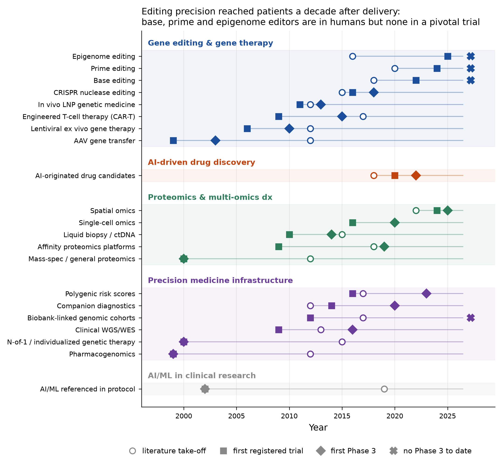
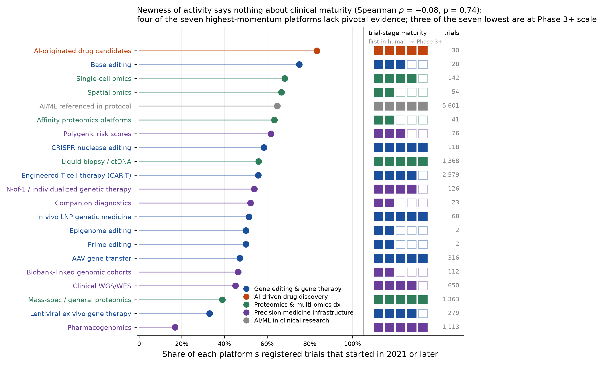
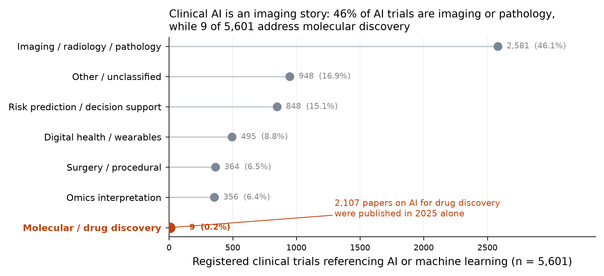

# Mapping technology timelines and market maturity in genomic and proteomic medicine

**A registry-grounded landscape for the paper's Section 1 (technology maturity), with the
investment-relevant reading of each timeline and the caveats that qualify it.**

Retrieval date: 2 September 2026. Revised the same day: all maturity stages are now produced
mechanically by the rules in Section 2 with no manual overrides (four rows moved), and the
industry-share comparison in Section 5 has been corrected. All counts in this document were computed from records
pulled that day; re-running the pipeline on a later date will shift them.

---

## 1. Why this map exists

The premise of the paper is that health-care AI attention is concentrated on the operational
and imaging layers of clinical practice, while the molecular layers — gene editing, drug
discovery, proteomics, precision-medicine infrastructure — carry a different and less
examined risk/return profile. Section 5 below tests that premise quantitatively rather than
asserting it; the rest of the document places 21 technology subfamilies on a common timeline
and a common maturity ladder so that "where are we" can be answered per platform instead of
per press release.

Two deliberate constraints shape what follows:

- **Evidence is registry and literature evidence.** Every date, count, phase and sponsor
  figure comes from ClinicalTrials.gov or PubMed. No market-size, valuation, or private
  financing figure appears in this document, because no such source was queried. Section 8
  states what a financing layer would add and where it would have to come from.
- **Regulatory approval status was not retrieved.** A platform's stage label describes the
  *trial evidence* it has accumulated ("multiple industry Phase 3+ programs"), not its
  approval status. Where the text refers to marketed products, it is flagged as background
  context rather than as a computed result.

---

## 2. Method

**Trial landscape.** ClinicalTrials.gov API v2 was queried once per subfamily using quoted
phrase searches (20 queries). The exact query string used for each subfamily is carried in the
`ctgov_query` and `pubmed_query` columns of `technology_maturity_matrix.csv`. The registry's search applies concept expansion, which
introduces substantial false positives: the query for lentiviral gene therapy returned 7,296
studies, of which the great majority were HIV trials matched through the lentivirus→HIV
concept link. Every returned record was therefore re-filtered with a literal
case-insensitive regular expression over title, brief summary, detailed description,
keywords, conditions and intervention names. Retention varied from 4% (lentiviral) to 100%
(prime editing); the filter reduced 25,600 returned records to **14,061 retained trial
records** across 13,486 unique registrations. Post-filter retention per subfamily is in the
saved code output and is the single most important quality figure in this pipeline.

**Technology-as-intervention flag.** For each retained record a second flag marks whether
the technology term appears in the *intervention name* or the *trial title*, as opposed to
only in the background text. This distinguishes a trial where the platform drives the
protocol from one where it appears as a correlative assay on banked samples. It matters
because trial phase is a property of the parent trial, not of the assay: mass-spectrometry
proteomics appears in 65 Phase 3+ trials, but in only 11 of them is proteomics named in the
intervention or title. All diagnostic staging below uses the flagged subset.

**Publication timeline.** PubMed E-utilities counts by publication year, 2012–2025, one
query per subfamily on title/abstract fields. "Literature take-off" is defined as the first
year in which annual volume reached 10% of that subfamily's peak year. For six subfamilies
the 2012 value already exceeded that threshold, meaning the take-off predates the window;
these are flagged `literature_predates_2012_window` and their take-off marker in Figure 1
should be read as left-censored.

**Maturity ladder.** Two rule sets, applied by modality, because a therapeutic's phase
progression and a diagnostic's adoption path are not the same ladder.

*Therapeutic* (gene editing, gene transfer, engineered cells, AI-originated molecules):

| Stage | Rule |
|---|---|
| 5 | ≥3 Phase 3+ trials **and** ≥30% industry-sponsored |
| 4 | ≥1 Phase 3+ trial |
| 3 | ≥10 interventional trials |
| 2 | ≥1 interventional trial |
| 1 | No registered interventional trial |

*Diagnostic/analytic* (proteomics, liquid biopsy, single-cell, spatial, PRS, PGx, CDx, WGS,
biobanks, clinical AI), using only records where the technology is named as intervention or
in the title:

| Stage | Rule |
|---|---|
| 5 | ≥5 assay-guided Phase 3+ trials **and** ≥200 total records |
| 4 | ≥1 assay-guided Phase 3+ trial and ≥100 total records |
| 3 | ≥10 assay-guided interventional trials |
| 2 | ≥20 total records |
| 1 | Below all of the above |

**AI-originated candidates.** "AI-designed" is not a registry field, so this row was built by
probing 33 named clinical candidates from platform companies against the registry's
intervention index and keeping only verified hits; five probes that are not
AI-platform-originated were removed from the analysis set. This yields **22 distinct molecules
with ≥1 registered trial across 30 trials** from Insilico Medicine, Recursion, Exscientia,
BenevolentAI, Schrödinger, Generate Biomedicines, Verge Genomics and Iambic. It is a
verified-hit probe, **not a census** — a candidate absent from the probe list is absent from
the count, and attribution of a molecule to an AI platform rests on company disclosure.

**Geography.** Location countries were pulled for the seven gene-editing and gene-transfer
subfamilies and tabulated on an any-site basis (a trial with sites in three countries counts
once for each). About 7% of these records list no location and are in the denominator, so
country shares are conservative.

---

## 3. The timeline map

Three readings matter for the paper.

**Delivery matured a decade before precision.** AAV gene transfer registered its first trial
in 1999 and its first Phase 3 in 2003; lentiviral ex vivo therapy followed in 2006 and 2010.
CRISPR nuclease editing entered the clinic in 2016 and reached Phase 3 in 2018 — a two-year
transit, the fastest in the map, because it inherited a delivery and manufacturing stack
that had already been de-risked by two decades of vector work. The editors that fix the
*specificity* problem have not inherited the same advantage: base editing first dosed a
patient in 2022 and has **no Phase 3 trial**; prime editing entered the clinic in 2024 with
**two registered trials**; epigenome editing in 2025 with **two**.

**The literature-to-clinic interval is not a constant.** For CRISPR, literature take-off
(2015) and first trial (2016) are one year apart. For prime editing, take-off was 2020 and
first trial 2024. For epigenome editing, 2016 and 2025 — nine years. A reader inferring
timelines from publication momentum alone would have mis-dated the last two by half a decade.

**Diagnostic platforms show the inverse pattern.** Liquid biopsy, single-cell and spatial
omics all appear in Phase 3+ trials within a few years of their literature take-off, but
overwhelmingly as measurement layers inside trials of something else. Spatial omics reached a
Phase 3 trial in 2025 while having only **three** interventional trials in which it is named
as intervention or in the title.

---

## 4. Maturity against momentum

The ordering here is the investment-relevant one, because it separates *where activity is
growing* from *where evidence has accumulated*.

- **High momentum, low maturity.** AI-originated candidates (83% of their trials started
  2021 or later), base editing (75%), single-cell omics (68%), spatial omics (67%), affinity
  proteomics (63%). These are the platforms where the pipeline is young enough that attrition
  has not yet been priced.
- **High maturity, low momentum.** Pharmacogenomics (17% post-2020, 232 Phase 3+ trials,
  literature CAGR 2020–2025 of +2%), mass-spectrometry proteomics (39%), lentiviral ex vivo
  therapy (33%, and the only subfamily in the set with *declining* publication volume, −6%
  annually since 2020, peak year 2018). These are consolidation stories, not growth stories.
- **The rare both.** CRISPR nuclease editing (59% post-2020 with seven Phase 3+ programs and
  21 distinct industry sponsors) and in vivo LNP-delivered genetic medicine (52% post-2020,
  three Phase 3+ programs). This is where a mature evidence base and current momentum
  coincide — and where the clinical-utility case is strongest today.

**Attrition is visible and unevenly distributed.** CRISPR nuclease editing has the highest
termination-or-withdrawal share in the map at **21% of 118 trials** (25 trials), followed by
AI-originated candidates at **20% of 30** (6 trials) and lentiviral ex vivo therapy at
**15% of 279**. For comparison, single-cell omics sits at 0.7% and clinical WGS/WES at 4.6% —
diagnostic programs fail quietly, therapeutic programs fail visibly. Any timeline projection
that extrapolates from registered starts without a discount for this rate will be optimistic
by roughly a fifth in the editing families.

**Trial economics differ by an order of magnitude.** Median enrollment is **20 participants**
for therapeutic-modality interventional trials versus **100** for diagnostic/analytic ones.
Polygenic risk score trials have a median enrollment of 831. The therapeutic path is small-n,
high-cost-per-patient, and regulatory-precedent-dependent; the diagnostic path is large-n and
depends on demonstrating decision change. These are different capital profiles and different
exit structures, and the paper should not treat them as one market.

---

## 5. Testing the paper's premise: where clinical AI actually goes

Of the **5,601** registered trials that reference artificial intelligence, machine learning,
deep learning or neural networks:

| Application area | Trials | Share | Industry-sponsored |
|---|---|---|---|
| Imaging / radiology / pathology | 2,581 | 46.1% | 234 |
| Other / unclassified | 948 | 16.9% | 117 |
| Risk prediction / decision support | 848 | 15.1% | 87 |
| Digital health / wearables | 495 | 8.8% | 57 |
| Surgery / procedural | 364 | 6.5% | 18 |
| Omics interpretation | 356 | 6.4% | 23 |
| **Molecular / drug discovery** | **9** | **0.2%** | **2** |

Categories are assigned by first match against an ordered keyword scheme with the molecular
category tested first, so the molecular count is an upper bound under this classifier, not a
lower one.

The premise holds, and holds more sharply than the paper's framing assumes. Clinical AI is
overwhelmingly a perception problem applied to images: imaging and pathology alone outnumber
molecular-facing trials by 287 to 1. Meanwhile the AI-for-drug-discovery literature published
**2,107 papers in 2025 alone**, growing at 38% annually since 2020. The gap between that
literature and nine registered trials is the structural fact the paper is looking for: the
molecular application of AI has generated publication volume and company formation without
yet generating the trial record that would let anyone price it.

The parallel finding is that the AI/ML trial population is **only 9.6% industry-sponsored**,
against 33.7% for gene editing and gene therapy. It is not the lowest in the map — proteomics
and multi-omics diagnostics (7.6%) and precision medicine infrastructure (8.8%) are lower, and
among the four registry-derived families gene editing is the only one above 10%. (The fifth
family, AI-driven drug discovery, is 100% industry-sponsored, but it is a curated probe of 22
named molecules rather than a registry query, so it is not comparable on this measure and is
excluded from the ranking.) That is the general pattern worth stating: outside
gene editing and gene therapy, registered trial activity across all of these fields is
overwhelmingly investigator-initiated evaluation rather than commercial development. An
investor reading trial volume as commercial commitment would misread every family except the
first.

---

## 6. Family-by-family reading

### Gene editing and gene therapy (3,392 records, 33.7% industry)

*What the timeline shows.* A mature delivery layer (AAV: 316 trials, 32 Phase 3+, 67%
industry, 98 distinct industry sponsors; lentiviral: 279 trials, 11 Phase 3+) and a mature
engineered-cell layer (CAR-T: 2,579 trials, 54 Phase 3+, first Phase 3 in 2015) supporting a
young editing layer. CRISPR nuclease editing has crossed into late-stage territory in eight
years; the three precision editors behind it have not.

*Commercial reading.* Editing-family industry sponsorship is concentrated but not
consolidated: 26 distinct companies sponsor the 71 industry-sponsored precision-editing
trials, led by CRISPR Therapeutics (9), CorrectSequence (7), HuidaGene (6) and Vertex (5).
Four of the eight most active sponsors are China-based. On an any-site basis China hosts
sites in **52% of CAR-T trials and 50% of base-editing trials**, against 30% and 29% for the
United States; the pattern reverses for AAV gene transfer (US 61%, China 20%). The
manufacturing- and delivery-heavy modality is US-centred; the cell- and editing-heavy
modalities are not. Any commercialisation timeline that assumes a US-first regulatory path
for editing is assuming away half the clinical activity.

*Caveats and weaknesses.* The 21% termination rate in CRISPR trials is the highest in the
map. Base editing's 28 trials come from only four industry sponsors, so its momentum is
sponsor-concentrated and would be materially affected by one company's strategic change.
Prime and epigenome editing rest on two registered trials each — no meaningful timeline can
be projected from n=2, and this document should not be cited as evidence that they are on a
trajectory. Delivery, not editing chemistry, remains the constraint the registry reflects:
the modality with 316 trials is the vector, not the editor.

*Gap to address.* There is no registry evidence of in vivo precision editing at scale. The
editors that promise single-base correction are being tested in the delivery contexts that
existing vectors permit, which is why their trial counts are small.

### AI-driven drug discovery (30 trials, 22 molecules)

*What the timeline shows.* First registered trial 2020; 25 of 30 trials started 2021 or
later; four Phase 3-labelled trials, all verified individually: rentosertib (Insilico,
idiopathic pulmonary fibrosis, Phase 3 registered for August 2026), REC-2282 (Recursion,
NF2-mutated meningioma, Phase 2/3, **terminated**), and two GB-0895 asthma trials from
Generate Biomedicines recruiting from December 2025 and January 2026.

*Commercial reading.* The generative-protein-design entry into Phase 3 is the most
consequential single data point in this family: it moves the AI-origination claim from
"molecule found faster" to "biologic designed and taken to a pivotal trial". Timeline
arithmetic from this cohort: first-in-human 2020 → first Phase 3 starts 2025–2026, i.e.
roughly five to six years from clinical entry to pivotal trial for the fastest programs,
which is not faster than the industry norm. The discovery-phase acceleration these platforms
claim, if real, has not yet shortened the clinical interval, and clinical interval is where
most of the cost and most of the risk sits.

*Caveats and weaknesses.* The rules place this row at stage 5 ("multiple industry Phase 3+
programs") on the strength of four Phase 3-labelled trials, but those four trials represent
only **three distinct molecules**, and one of the three has been terminated. Read against AAV
gene transfer's 32 Phase 3+ trials, the identical stage label conceals a large difference in
depth; the stage rule counts trials, not programs. n=22 molecules; the 20% termination rate matches the noisiest therapeutic family in
the map. Attribution depends on company disclosure and cannot be independently verified from
the registry. This row is the least statistically robust in the document and the most likely
to be over-read.

*Gap to address.* No public dataset links an AI-originated candidate to a discovery-phase
duration or cost, which is precisely the quantity the investment case rests on. Until
programs report discovery timelines in a comparable format, the claim is unfalsifiable from
public data.

### Proteomics and multi-omics diagnostics (2,968 records, 7.6% industry)

*What the timeline shows.* Mass-spectrometry proteomics has been present in trials since 2000
and appears in 65 Phase 3+ trials, but is named as intervention or in the title in only 108
interventional trials. Liquid biopsy is the family's real translation success: 1,368 records,
278 assay-guided interventional trials, 23 of them Phase 3+, first Phase 3 in 2014. Affinity
proteomics platforms (SomaScan, Olink) have 41 records and **one** assay-guided
interventional trial. Spatial omics has the steepest literature growth in the entire map —
publication volume doubling annually since 2020 (+100% CAGR) — and 15 interventional trials,
of which three name the assay as intervention, which is why the rules place it at stage 2.

*Commercial reading.* Liquid biopsy demonstrates the diagnostic path that works: an assay
that changes a treatment decision, tested in trials where it drives the protocol, reaching
pivotal scale in roughly a decade. Affinity proteomics has not taken that path — it has
generated cohort-scale evidence (median enrollment 40; the family's large-cohort proteomic
studies) without assay-guided interventional evidence. That is a reimbursement problem
waiting to happen: payers pay for decisions changed, not for proteins measured.

*Caveats and weaknesses.* This family's trial-phase statistics are the most easily misread in
the map. Being present in a Phase 3 oncology trial as a correlative assay is not clinical
validation of the assay, and the unfiltered numbers would suggest a maturity these platforms
do not have. Industry sponsorship at 7.6% is the lowest of any family in the map.

*Gap to address.* Almost no registered trials test whether a plasma proteomic panel changes
management. Until they exist, the clinical-utility case for affinity proteomics rests on
prognostic association studies, which do not support a reimbursement claim.

### Precision medicine infrastructure (2,100 records, 8.8% industry)

*What the timeline shows.* A split family. Pharmacogenomics is fully mature and slowing: 1,113
records, 232 Phase 3+ trials, first Phase 3 in 1999, 17% of trials post-2020, publication
growth of 2% annually. Clinical WGS/WES: 650 records, 15 Phase 3+, but only 78 assay-guided
interventional trials. Polygenic risk scores reached their first Phase 3 in 2023 with a
median enrollment of 831 — the largest in the map — and sit at stage 3 (19 assay-guided
interventional trials, below the 100-record threshold for stage 4). N-of-1 individualized genetic therapy has
126 records, 31 Phase 3+ labels, and 4.8% industry sponsorship. Companion diagnostics, as a
registry category, is nearly invisible at 23 records (stage 2) — because approved companion diagnostics
are embedded in drug trials rather than registered as diagnostic studies.

*Commercial reading.* This family is where the clinical-utility and investment cases diverge
most sharply. Pharmacogenomics has the strongest evidence base in the entire map and the
weakest growth signal — the value has been captured into standard practice rather than into
returns. N-of-1 therapy shows the opposite: real clinical activity at 96% non-industry
sponsorship, which means it is being delivered as academic medicine because no commercial
model supports a single-patient product. PRS is the family's genuine open question: growing,
now in randomized trials, with unresolved questions about cross-ancestry portability that
the registry cannot address but that determine whether the tool is deployable in a general
population.

*Caveats and weaknesses.* The N-of-1 Phase 3 labels should not be read as pivotal-trial
evidence for individualized therapy; the label attaches to trials with heterogeneous designs,
and this subfamily's 18 publications in 2025 indicate a literature far smaller than its trial
count implies. The companion-diagnostics count is a registry artefact, not a measure of the
field.

*Gap to address.* Infrastructure investment (biobanks: 112 records, 0.9% industry, three
assay-guided interventional trials) has produced discovery capacity without a mechanism that
returns clinical decisions to patients. This is the clearest instance in the map of capital
deployed into a layer that does not itself generate clinical utility.

---

## 7. What this method cannot tell you

Stated plainly, because the paper will be read by people who will want to cite these numbers.

1. **No financing data.** Trial counts are not investment. A platform with 30 trials may have
   raised more than one with 300. Nothing here measures capital deployed, valuation, deal
   volume or exit outcomes.
2. **No approval status.** Stage 5 means late-phase industry trial activity, not market
   authorisation. A regulatory database (openFDA, EMA, or CBER's cellular and gene therapy
   listings) would be needed to add approvals, and was not queried.
3. **Registration is not activity.** Registered trials include never-started, withdrawn and
   silently abandoned programs. The termination shares in Section 4 capture only what
   sponsors updated.
4. **Registry coverage is incomplete and geographically uneven.** Trials registered only in
   the Chinese Clinical Trial Registry, EudraCT, jRCT or CTIS are absent. The China shares in
   Section 6 are therefore lower bounds, and the overall map under-represents non-US activity.
5. **Keyword identification has irreducible error.** A trial whose protocol text omits the
   platform term is missed; a trial that mentions it in passing is retained. The literal
   regex filter reduces but does not eliminate this in either direction.
6. **Publication counts are activity, not quality.** Volume growth measures attention. The
   left-censoring flag matters: six subfamilies' take-off predates the 2012 window.
7. **The AI-originated row is a probe, not a census**, and its four Phase 3 labels rest on
   four individual trials.
8. **Stage thresholds are choices.** The cut-points (≥3 Phase 3+, ≥30% industry, ≥10
   interventional) are defensible but arbitrary; two subfamilies sit within one trial of a
   boundary. Every `stage_n` in `technology_maturity_matrix.csv` is generated mechanically by
   the Section 2 rules from columns in that same file, with no manual overrides, so a reader
   can reproduce the staging exactly or re-stage under different cut-points. Because the
   therapeutic rule counts Phase 3+ *trials* rather than distinct programs, a platform with
   many trials of few molecules scores the same as one with many molecules — see the
   AI-originated caveat above.

---

## 8. Gaps to address, and what to add next

**The financing layer is the missing half.** Every question the paper wants to answer about
investment opportunity — what has been tried commercially, what returned, where capital is
mispriced relative to evidence — requires deal-level data this pipeline cannot reach:
financing rounds, public-market performance of the platform companies, licensing terms,
and write-offs. That data is proprietary (PitchBook, Cortellis, Evaluate, BioCentury) or
scattered across SEC filings. Merging a deal table onto `technology_maturity_matrix.csv` by
subfamily would make the mispricing argument directly, and the maturity/momentum axes in
Figure 2 are constructed to accept exactly that join.

**Three additions that are reachable from public sources.**

1. **Approvals and regulatory precedent** — openFDA plus CBER listings, giving a fourth
   milestone marker in Figure 1 and converting stage 5 from an evidence claim to a market
   claim.
2. **Non-US registries** — CTIS and the Chinese registry, to correct the geographic
   under-count that currently makes the editing families look more US-centred than they are.
3. **Sponsor-level trajectories** — the 355 industry sponsors in the AI/ML set and the 98 in
   AAV are already in `trial_records.csv`; tracking first-trial to latest-trial per sponsor
   would show which companies are compounding programs and which registered once and stopped,
   a better commitment signal than trial volume.

**The analytical gap worth arguing in the paper.** The map shows two failure modes that are
usually discussed separately but are the same problem. In the therapeutic families, precision
arrived after delivery and is now rate-limited by it. In the diagnostic families,
measurement arrived long before decision-change evidence and is now rate-limited by it. In
both cases the enabling layer matured and the value-capturing layer did not, and in both
cases the capital went to the layer that was easier to demonstrate. Clinical AI's 46%/0.2%
split between imaging and molecular applications is the third instance of the same pattern.
That is a stronger and more defensible thesis than "molecular AI is underrated", and it is
supported by all three figures.

---

## 9. Files

| File | Contents |
|---|---|
| `technology_maturity_matrix.csv` | 21 subfamilies × 34 columns — the master table behind every figure, including the exact registry and PubMed query used for each row |
| `trial_records.csv` | 14,061 filtered trial records with NCT ID, phase, sponsor, dates, intervention flag |
| `ai_originated_candidates.csv` | 30 verified trials of 22 AI-platform-originated molecules |
| `ai_trials_by_application.csv` | The 5,601 AI/ML trials by application area |
| `publication_timeline.csv` | PubMed counts by year (2012–2025) × 21 subfamilies |
| `editing_trial_geography.csv` | Country participation for the seven editing/transfer subfamilies |
